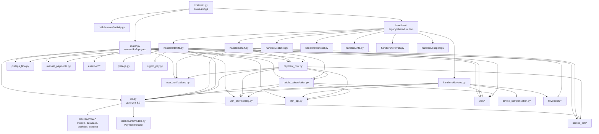

# Интерактивная диаграмма проекта: модуль `bot`

## Зачем нужен этот документ

Это рабочая карта основного клиентского Telegram-бота `amonora/bot/`: что в нём лежит, какие файлы за что отвечают и как они связаны между собой.

Документ полезен, когда нужно:
- быстро понять точки входа;
- найти нужный слой для изменений;
- не путать `v2`-роутер и legacy-обработчики;
- видеть, где проходят платежи, устройства, trial и публичная подписка.

---

## 1. Карта взаимодействий



---

## 2. Быстрое чтение слоями

| Слой | Основные файлы | Роль |
|---|---|---|
| Вход | `main.py` | Поднимает `Dispatcher`, подключает роутеры, middleware и запускает polling |
| UI / orchestration | `router.py` | Главный `v2`-сценарий бота: onboarding, trial, ключ, меню, бонусы, оплата, экраны |
| Legacy handlers | `handlers/*.py` | Старые или частично переиспользуемые роутеры по доменам |
| Data access | `db.py` | Операции с пользователями, устройствами, платежами, рефералами, trial, public subscription |
| Payments | `payment_flow.py`, `manual_payments.py`, `platega_flow.py`, `platega.py`, `crypto_pay.py` | Создание и завершение платежей, активация доступа, синхронизация результатов |
| VPN / provisioning | `vpn_api.py`, `vpn_provisioning.py`, `public_subscription.py`, `device_compensation.py` | Работа с 3x-ui/XUI, выпуск конфигов, публичная подписка, восстановление устройств |
| Presentation | `keyboards/*.py`, `utils/texts.py`, `assets/v2/*` | Кнопки, тексты, картинки экранов |
| Domain utils | `utils/*.py` | Тарифы, режимы, регионы, слоты устройств, VLESS, routing pack, доступ |
| Infra glue | `config.py`, `middlewares/activity.py`, `user_notifications.py` | Конфиг, активность пользователя, отправка сообщений |

---

## 3. Дерево папок и файлов

```text
amonora/bot/
├── main.py                      # вход в бот, сборка Dispatcher и роутеров
├── router.py                    # основной v2-роутер, фактический центр продукта
├── config.py                    # ENV-конфигурация
├── db.py                        # слой доступа к БД и доменным сущностям
│
├── payment_flow.py              # финализация платежей и активация доступа
├── manual_payments.py           # ручные платежи и уведомления саппорту
├── platega.py                   # HTTP-клиент Platega
├── platega_flow.py              # orchestration вокруг Platega-платежей
├── crypto_pay.py                # HTTP-клиент Crypto Pay
│
├── vpn_api.py                   # XUIClient, прямое API к VPN-панели
├── vpn_provisioning.py          # абстракция provisioner, сборка VLESS-метаданных
├── public_subscription.py       # public subscription / Happ / tokenized access
├── device_compensation.py       # фоновые шаги после создания устройства
├── device_limit_hardening.py    # защита и ужесточение лимитов устройств
├── repair_reasons.py            # словарь причин repair/sync-инцидентов
├── user_notifications.py        # отправка сообщений пользователям
│
├── handlers/
│   ├── start.py                 # старт, trial, подписка на канал, возврат в меню
│   ├── devices.py               # создание/удаление/настройка устройств
│   ├── tariffs.py               # тарифы, методы оплаты, external/manual flows
│   ├── cabinet.py               # кабинет и статус доступа
│   ├── protocol.py              # выбор режима/протокола
│   ├── info.py                  # инфо-экраны
│   ├── referrals.py             # реферальный раздел
│   └── support.py               # вход в поддержку
│
├── keyboards/
│   ├── home.py                  # домашние кнопки
│   ├── main_menu.py             # legacy reply-клавиатуры меню
│   ├── tariffs.py               # тарифы и платёжные кнопки
│   ├── devices.py               # UI устройств и Happ
│   ├── protocols.py             # выбор режимов
│   ├── referrals.py             # реферальные кнопки
│   └── info.py                  # инфо-раздел и документы
│
├── middlewares/
│   └── activity.py              # обновление активности пользователя
│
├── utils/
│   ├── access.py                # доступ, trial, лимиты, expires_at
│   ├── device_slots.py          # дополнительные слоты устройств
│   ├── logging_setup.py         # логирование
│   ├── modes.py                 # режимы подключения
│   ├── payment_options.py       # правила выбора способов оплаты
│   ├── qr.py                    # генерация QR
│   ├── referrals.py             # реферальные расчёты и модели вывода
│   ├── regions.py               # регионы, флаги, лимиты, страны
│   ├── routing.py               # split-routing pack
│   ├── subscription.py          # проверка подписки на канал
│   ├── subscription_accounting.py # учёт продлений и ручных extension
│   ├── tariffs.py               # тарифы и маркетинговые названия
│   ├── texts.py                 # тексты UI и уведомлений
│   └── vless.py                 # VLESS/Trojan links и connection metadata
│
└── assets/
    └── v2/                      # изображения экранов основного v2-потока
```

---

## 4. Раскрытая карта по папкам

<details>
<summary><strong>main.py и router.py</strong></summary>

### `main.py`

- Конструирует `Dispatcher`.
- Подключает `bot/router.py` первым.
- После него подключает legacy-роутеры из `handlers/`.
- Вешает `UserActivityMiddleware`.
- Делает `ensure_schema()` и запускает polling.

### `router.py`

Это главный продуктовый слой бота.

Здесь собраны:
- onboarding и `/start`;
- trial и принятие соглашения;
- v2-экраны с картинками из `assets/v2/`;
- экран ключа и Happ-подписки;
- бонусная система и промокоды;
- продление подписки и пополнение баланса;
- ручные и внешние платежи;
- удаление устройств и работа с device slots.

По факту это orchestrator, который тянет почти все доменные модули:
- `db.py`;
- `payment_flow.py`;
- `platega_flow.py`;
- `public_subscription.py`;
- `vpn_api.py` и `vpn_provisioning.py`;
- `manual_payments.py`;
- `user_notifications.py`;
- `utils/*`.

</details>

<details>
<summary><strong>handlers/</strong></summary>

### Что это за слой

`handlers/` содержит отдельные доменные роутеры старой архитектуры. Они всё ещё подключены в `main.py`, но основной пользовательский поток уже ведёт `bot/router.py`.

### Кто за что отвечает

- `start.py`:
  стартовый сценарий, trial, проверка подписки на канал, восстановление главного меню.
- `devices.py`:
  самый насыщенный legacy-модуль после `router.py`; создание устройства, смена страны/режима, выпуск ссылки, QR, split routing.
- `tariffs.py`:
  тарифы, оплата, balance top-up, доп. слоты устройств, manual/external payment flows.
- `cabinet.py`:
  кабинет, статус подписки и переходы в тарифы.
- `protocol.py`:
  выбор режима подключения.
- `info.py`:
  инфо-раздел, документы, инструкции.
- `referrals.py`:
  экран бонусной программы и реферальная ссылка.
- `support.py`:
  точка входа в поддержку.

### Практический смысл

Для дальнейшей разработки полезно воспринимать `handlers/` как папку с доменными вертикалями:
- устройства;
- тарифы и платежи;
- старт и trial;
- справка и бонусы.

</details>

<details>
<summary><strong>keyboards/ и assets/</strong></summary>

### `keyboards/`

Слой UI-компоновки кнопок:
- `devices.py` формирует интерфейс создания и управления устройствами;
- `tariffs.py` отвечает за кнопки тарифов, способов оплаты, пополнения и device slots;
- `home.py` управляет домашними inline-действиями, а `main_menu.py` остаётся в legacy-слое;
- `info.py`, `protocols.py`, `referrals.py` закрывают узкие сценарии.

### `assets/v2/`

Набор картинок экранов для v2-интерфейса. Используются из `router.py` как часть экранной модели "картинка + HTML-текст + inline-кнопки".

</details>

<details>
<summary><strong>db.py</strong></summary>

`db.py` это доменный фасад над БД. Почти весь бот завязан на него.

Основные зоны ответственности:
- пользователи и trial;
- активность и доступ;
- VPN-клиенты и устройства;
- платежи и payment intent;
- баланс;
- public subscription links/routes;
- рефералы и бонусы;
- analytics/control-side эффекты.

Внешние связи:
- читает и пишет через `backend.core.database.async_session`;
- использует ORM-модели из `backend.core.models`;
- работает с `dashboard.models.PaymentRecord`;
- местами триггерит `control_bot`-события;
- опирается на `utils/*` для расчётной логики.

Если нужно "где реально меняются данные", в большинстве сценариев ответ будет: `db.py`.

</details>

<details>
<summary><strong>Платёжный контур</strong></summary>

### Основные файлы

- `payment_flow.py`
- `manual_payments.py`
- `platega_flow.py`
- `platega.py`
- `crypto_pay.py`
- `handlers/tariffs.py`
- `router.py`

### Роли

- `handlers/tariffs.py` и `router.py`:
  пользовательская точка входа в оплату.
- `platega.py`, `crypto_pay.py`:
  низкоуровневые HTTP-клиенты провайдеров.
- `platega_flow.py`:
  собирает и синхронизирует записи Platega с внутренними payment records.
- `manual_payments.py`:
  уведомляет админов и завершает ручные сценарии.
- `payment_flow.py`:
  центральная бизнес-логика после подтверждения оплаты.

### Что делает `payment_flow.py`

- применяет эффект платежа;
- активирует или продлевает доступ;
- выдаёт device slot entitlement;
- запускает синхронизацию доступа на VPN-узлах;
- обновляет public subscription access;
- начисляет реферальные бонусы;
- шлёт уведомления пользователю;
- фиксирует repair-состояния, если синхронизация доступа пошла не так.

</details>

<details>
<summary><strong>VPN и устройства</strong></summary>

### Основные файлы

- `vpn_api.py`
- `vpn_provisioning.py`
- `public_subscription.py`
- `handlers/devices.py`
- `device_compensation.py`
- `device_limit_hardening.py`
- `utils/vless.py`
- `utils/routing.py`
- `utils/regions.py`
- `utils/modes.py`

### Роли

- `vpn_api.py`:
  прямой клиент к 3x-ui/XUI API.
- `vpn_provisioning.py`:
  абстракция provisioner, сборка метаданных, создание/синхронизация/удаление клиента.
- `handlers/devices.py`:
  пользовательская оркестрация устройства.
- `public_subscription.py`:
  unified subscription flow и Happ-compatible публичная ссылка.
- `device_compensation.py`:
  добивает фоновые шаги после выпуска устройства.
- `device_limit_hardening.py`:
  отдельный защитный слой вокруг лимитов и консистентности.

### Главная идея

Устройства живут на пересечении трёх слоёв:
- UI и сценарии: `handlers/devices.py` или `router.py`;
- данные и владение устройством: `db.py`;
- реальное состояние на VPN-ноде: `vpn_provisioning.py` + `vpn_api.py`.

</details>

<details>
<summary><strong>utils/</strong></summary>

Это библиотека доменных правил бота.

Самые важные файлы:
- `access.py`:
  статус доступа, trial-окна, лимиты устройств, расчёт истечения.
- `texts.py`:
  тексты экранов и сообщений; главный словарь UX-контента.
- `tariffs.py`:
  каталог тарифов и маркетинговые названия.
- `regions.py`:
  нормализация стран, доступность регионов, флаги, лимиты.
- `modes.py`:
  режимы подключения и совместимость.
- `device_slots.py`:
  правила для доп. слотов и их цены.
- `vless.py`:
  сборка VLESS/Trojan ссылок и connection metadata.
- `routing.py`:
  split-routing pack для части устройств и сценариев.

</details>

---

## 5. Как идут основные сценарии

### Старт и trial

```text
main.py
  -> router.py или handlers/start.py
  -> db.py (get/create user, bind referrer, activate trial)
  -> utils/subscription.py (проверка подписки на канал)
  -> payment_flow.py (sync доступа после resume)
  -> user получает меню / trial / home
```

### Покупка подписки

```text
router.py или handlers/tariffs.py
  -> db.py (payment intent / payment record)
  -> platega_flow.py | manual_payments.py | crypto_pay.py
  -> payment_flow.py (финализация)
  -> db.py (доступ, баланс, entitlement)
  -> vpn_provisioning.py + vpn_api.py (синхронизация доступа)
  -> public_subscription.py (обновление публичной подписки)
  -> user_notifications.py
```

### Выпуск устройства

```text
handlers/devices.py
  -> db.py (создание vpn_client)
  -> vpn_provisioning.py (provision client)
  -> vpn_api.py (операции на панели)
  -> utils/vless.py и utils/routing.py
  -> generate_qr_image()
  -> device_compensation.py при необходимости
```

### Экран ключа / публичная подписка

```text
router.py
  -> public_subscription.py
  -> db.py (link + routes)
  -> vpn_provisioning.py / vpn_api.py
  -> utils/vless.py
  -> Happ / public URL для пользователя
```

---

## 6. Где лучше вносить изменения

| Задача | Куда идти сначала |
|---|---|
| Новый экран главного пользовательского потока | `router.py` |
| Изменить логику trial/start | `router.py`, `handlers/start.py`, `db.py`, `utils/access.py` |
| Изменить оплату/методы оплаты | `handlers/tariffs.py`, `router.py`, `payment_flow.py`, `platega_flow.py`, `manual_payments.py` |
| Поменять тексты | `utils/texts.py` |
| Поменять кнопки и раскладку | `keyboards/*.py` или `router.py` |
| Исправить устройства / конфиги / QR | `handlers/devices.py`, `vpn_provisioning.py`, `vpn_api.py`, `utils/vless.py` |
| Изменить правила лимитов устройств | `utils/device_slots.py`, `utils/access.py`, `device_limit_hardening.py`, `db.py` |
| Изменить public subscription / Happ | `public_subscription.py` |
| Изменить SQLAlchemy-операции и запись данных | `db.py` |

---

## 7. Главные узлы внимания

Если смотреть на модуль `bot` как на карту для будущей разработки, самые важные точки такие:

- `router.py`:
  самый связанный файл, центр пользовательского v2-flow.
- `db.py`:
  главный data-layer и доменный фасад.
- `payment_flow.py`:
  центр пост-платёжной бизнес-логики.
- `public_subscription.py`:
  отдельный важный контур для unified subscription и Happ.
- `handlers/devices.py`:
  главный вертикальный модуль по устройствам.
- `handlers/tariffs.py`:
  главный vertical slice по тарифам и оплате в legacy-слое.

---

## 8. Короткий вывод

Модуль `bot` устроен как смесь:
- одного большого orchestration-файла `router.py`;
- набора доменных legacy-роутеров в `handlers/`;
- общего data-layer в `db.py`;
- отдельных контуров для платежей, VPN и public subscription;
- UI-слоя из `keyboards/`, `texts.py` и `assets/v2/`.

Для дальнейшей работы удобнее всего мыслить так:
- пользовательский сценарий ищем в `router.py` или `handlers/*.py`;
- бизнес-эффект и запись в БД ищем в `db.py` и `payment_flow.py`;
- реальное VPN-поведение ищем в `vpn_provisioning.py` и `vpn_api.py`.
