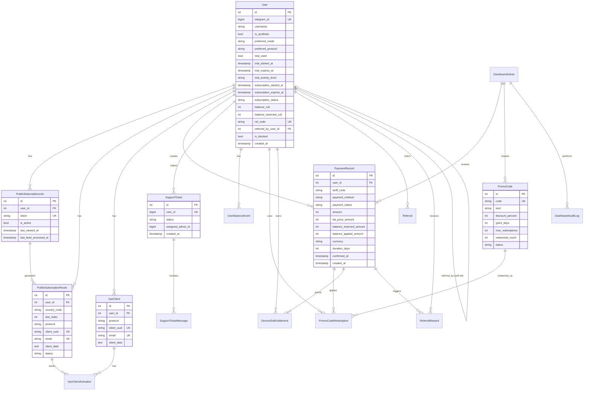

# База данных

## Подключение

| Параметр | Значение |
|----------|----------|
| СУБД | PostgreSQL |
| Драйвер | `asyncpg` |
| ORM | SQLAlchemy 2.0 (`declarative_base`) |
| Сессия | `AsyncSession` с `expire_on_commit=False` |
| ENV | `DB_HOST`, `DB_PORT`, `DB_NAME`, `DB_USER`, `DB_PASS` → `config.database_url` |

## ER-диаграмма (основные таблицы)

## Основные таблицы

### users

Главная таблица пользователей. Содержит профиль, trial, подписку, баланс, рефералы.

| Колонка | Тип | Описание |
|---------|-----|----------|
| `id` | INT PK | Автоинкремент |
| `telegram_id` | BIGINT UNIQUE | Telegram ID |
| `username` | VARCHAR(255) | Username |
| `is_synthetic` | BOOLEAN | Bridge-user / синтетический |
| `preferred_mode` | VARCHAR(20) | Legacy: stable/mobile/reserve |
| `preferred_protocol` | VARCHAR(50) | Legacy: vless/trojan |
| `trial_used` | BOOLEAN | Trial активирован |
| `trial_started_at` | TIMESTAMP | Начало trial |
| `trial_expires_at` | TIMESTAMP | Окончание trial |
| `trial_activity_level` | VARCHAR(20) | low/medium/high |
| `subscription_started_at` | TIMESTAMP | Начало платной подписки |
| `subscription_expires_at` | TIMESTAMP | Окончание подписки |
| `subscription_status` | VARCHAR(50) | active/inactive/expired |
| `subscription_source` | VARCHAR(50) | Источник оплаты |
| `balance_rub` | INT | Основной баланс (RUB) |
| `balance_reserved_rub` | INT | Зарезервированный баланс |
| `ref_code` | VARCHAR(32) UNIQUE | Реферальный код |
| `referred_by_user_id` | INT FK→users | Кто пригласил |
| `referral_bonus_granted` | BOOLEAN | Бонус уже выдан |
| `referral_earned_total_rub` | INT | Всего заработано |
| `is_blocked` | BOOLEAN | Доступ заблокирован |
| `last_activity_at` | TIMESTAMP | Последняя активность |
| `created_at` | TIMESTAMP | Дата регистрации |

### public_subscription_links

Один токен на пользователя → единая ссылка на подписку.

| Колонка | Тип | Описание |
|---------|-----|----------|
| `id` | INT PK | |
| `user_id` | INT FK→users ON DELETE CASCADE | |
| `token` | VARCHAR(64) UNIQUE | URL-safe токен (~24 символа) |
| `is_active` | BOOLEAN DEFAULT TRUE | |
| `last_viewed_at` | TIMESTAMP | Последний просмотр страницы |
| `last_feed_accessed_at` | TIMESTAMP | Последний доступ к Happ feed |
| `created_at`, `updated_at` | TIMESTAMP | |
| `rotated_at`, `revoked_at` | TIMESTAMP | Ротация/отзыв |

### public_subscription_routes

Маршруты: по одному на `(user_id, country_code, slot_index)`.

| Колонка | Тип | Описание |
|---------|-----|----------|
| `id` | INT PK | |
| `user_id` | INT FK→users ON DELETE CASCADE | |
| `country_code` | VARCHAR(10) | de/dk/ee |
| `slot_index` | INT DEFAULT 1 | 1..N |
| `protocol` | VARCHAR(50) DEFAULT 'vless' | |
| `client_uuid` | VARCHAR(255) UNIQUE | |
| `email` | VARCHAR(255) UNIQUE | Метка в VPN-панели |
| `xui_client_id` | VARCHAR(255) | ID в 3x-ui |
| `client_data` | TEXT (JSON) | vless_link, trojan_link, метаданные |
| `status` | VARCHAR(30) DEFAULT 'active' | active/disabled/broken |
| `disabled_at` | TIMESTAMP | |

Уникальные: `(user_id, country_code, slot_index)`, `client_uuid`, `email`.

### vpn_clients

Legacy per-device VPN клиенты (используются в старом flow, не в единой подписке).

| Колонка | Тип | Описание |
|---------|-----|----------|
| `id` | INT PK | |
| `user_id` | INT FK→users | |
| `protocol` | VARCHAR(50) | vless/trojan |
| `client_uuid` | VARCHAR(255) UNIQUE | |
| `email` | VARCHAR(255) UNIQUE | |
| `xui_client_id` | VARCHAR(255) | |
| `client_data` | TEXT (JSON) | |

### vpn_client_activations

Отслеживание активаций устройств по fingerprint.

| Колонка | Тип | Описание |
|---------|-----|----------|
| `id` | INT PK | |
| `vpn_client_id` | INT FK→vpn_clients ON DELETE CASCADE | |
| `user_id` | INT FK→users ON DELETE SET NULL | |
| `country_code` | VARCHAR(10) | |
| `fingerprint_hash` | VARCHAR(64) | |
| `device_label` | VARCHAR(255) | |
| `platform` | VARCHAR(50) | android/ios/windows/... |
| `app_version` | VARCHAR(50) | |
| `source_ip` | VARCHAR(64) | |
| `user_agent` | VARCHAR(500) | |
| `activation_count` | INT DEFAULT 1 | |
| `first_activated_at`, `last_activated_at` | TIMESTAMP | |

### payment_records

| Колонка | Тип | Описание |
|---------|-----|----------|
| `id` | INT PK | |
| `user_id` | INT FK→users | |
| `tariff_code` | VARCHAR(50) | 1m/3m/6m/12m |
| `payment_method` | VARCHAR(50) | stars/platega_sbp/platega_crypto/sbp_manual/crypto_manual/balance |
| `payment_status` | VARCHAR(50) | pending/awaiting_admin_review/confirmed/rejected/expired |
| `amount` | INT | Фактическая сумма |
| `list_price_amount` | INT | Базовая цена |
| `balance_reserved_amount` | INT | Зарезервировано с баланса |
| `balance_applied_amount` | INT | Применено с баланса |
| `currency` | VARCHAR(20) DEFAULT 'RUB' | |
| `duration_days` | INT | |
| `external_payment_id` | VARCHAR(255) | ID от Platega/Stars |
| `reference` | VARCHAR(255) | Реквизиты для ручной оплаты |
| `metadata_json` | TEXT (JSON) | |
| `reviewed_by_actor_id` | VARCHAR(255) | Кто подтвердил (admin) |
| `reviewed_at` | TIMESTAMP | |
| `rejection_reason` | TEXT | |
| `confirmed_at` | TIMESTAMP | |
| `expires_at` | TIMESTAMP | |
| `created_at` | TIMESTAMP | |

### support_tickets

| Колонка | Тип | Описание |
|---------|-----|----------|
| `id` | INT PK | |
| `user_id` | BIGINT UNIQUE | Telegram ID |
| `username` | VARCHAR(255) | |
| `full_name` | VARCHAR(255) | |
| `status` | VARCHAR(50) | new/in_progress/closed |
| `assigned_admin_id` | BIGINT | |
| `assigned_admin_name` | VARCHAR(255) | |
| `last_message_preview` | TEXT | |
| `created_at`, `updated_at`, `closed_at` | TIMESTAMP | |

### support_ticket_messages

| Колонка | Тип | Описание |
|---------|-----|----------|
| `id` | INT PK | |
| `ticket_id` | INT FK→support_tickets ON DELETE CASCADE | |
| `role` | VARCHAR(20) | user/admin |
| `sender_id` | BIGINT | |
| `content_type` | VARCHAR(50) | text/photo/video/audio/document |
| `text` | TEXT | |
| `attachment_file_id` | VARCHAR(255) | Telegram file_id |
| `attachment_kind` | VARCHAR(50) | photo/video/audio/document |
| `attachment_name` | VARCHAR(255) | |
| `attachment_mime_type` | VARCHAR(255) | |
| `attachment_size` | INT | |
| `created_at` | TIMESTAMP | |

### promo_codes

| Колонка | Тип | Описание |
|---------|-----|----------|
| `id` | INT PK | |
| `code` | VARCHAR(64) UNIQUE | |
| `kind` | VARCHAR(32) | discount_percent/days_credit/gift_days |
| `title` | VARCHAR(255) | |
| `discount_percent` | INT | |
| `grant_days` | INT | |
| `max_redemptions` | INT DEFAULT 1 | |
| `redeemed_count` | INT DEFAULT 0 | |
| `status` | VARCHAR(32) DEFAULT 'active' | |
| `expires_at` | TIMESTAMP | |
| `created_by_admin_id` | INT FK→dashboard_admins | |
| `buyer_user_id` | INT FK→users | Для gift-кодов |
| `payment_record_id` | INT FK→payment_records | |

### promo_code_redemptions

| Колонка | Тип | Описание |
|---------|-----|----------|
| `id` | INT PK | |
| `promo_code_id` | INT FK→promo_codes ON DELETE CASCADE | |
| `user_id` | INT FK→users ON DELETE CASCADE | |
| `status` | VARCHAR(32) DEFAULT 'applied' | |
| `discount_percent` | INT | |
| `granted_days` | INT | |
| `applied_payment_record_id` | INT FK→payment_records | |
| `redeemed_at`, `applied_at`, `reversed_at` | TIMESTAMP | |

### device_slot_entitlements

| Колонка | Тип | Описание |
|---------|-----|----------|
| `id` | INT PK | |
| `user_id` | INT FK→users ON DELETE CASCADE | |
| `payment_record_id` | INT FK→payment_records ON DELETE CASCADE | |
| `slots_count` | INT DEFAULT 1 | |
| `unit_price_rub` | INT DEFAULT 0 | Обычно 49 |
| `total_amount_rub` | INT | |
| `starts_at`, `expires_at` | TIMESTAMP | До конца подписки |
| `status` | VARCHAR(30) DEFAULT 'active' | |

### user_balance_events

Аудит баланса. Каждый event — credit или debit.

| Колонка | Тип | Описание |
|---------|-----|----------|
| `id` | INT PK | |
| `user_id` | INT FK→users | |
| `amount` | INT | |
| `direction` | VARCHAR(20) | credit/debit |
| `reason` | VARCHAR(100) | referral_bonus/topup/payment/refund |
| `reference_type` | VARCHAR(100) | referral/payment/promo |
| `reference_id` | VARCHAR(255) | |
| `note` | TEXT | |
| `created_at` | TIMESTAMP | |

### referrals + referral_rewards

| Таблица | Колонки |
|---------|---------|
| `referrals` | id, referrer_user_id FK, invited_user_id FK UNIQUE, created_at |
| `referral_rewards` | id, referrer_user_id FK, invited_user_id FK, payment_record_id FK UNIQUE, tariff_code, bonus_referrer_rub, bonus_invited_rub, status, created_at |

## Миграции

**Система:** Registry-таблица `schema_migration_steps` (step_key VARCHAR PK, applied_at TIMESTAMP).

- 96+ шагов миграции (`core_001` ... `core_096+`)
- Каждый шаг: `(key, ALTER/CREATE TABLE statement, verify_query)`
- `ensure_schema()` вызывается при старте сервисов
- `AUTO_APPLY_SCHEMA=1` для автоматического применения
- Проверяет 40+ колонок и 50+ индексов на 15+ таблицах

**Файл:** `backend/core/schema.py`
