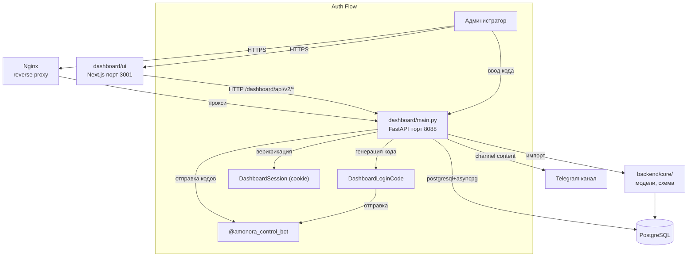

# Веб-панель (Dashboard)

## Обзор

Панель управления Amonora — это двухуровневая система администрирования:

- **dashboard/** — FastAPI backend админки (порт 8088)
- **dashboard/ui/** — Next.js фронтенд (порт 3001)
- **dashboard/templates/** — Legacy Jinja2 UI (сохраняется для совместимости)

Панель используется **администраторами** и **менеджерами** команды Amonora для управления пользователями, платежами, серверами, финансами и поддержкой.

---

## 1. Dashboard Backend (`dashboard/`)

### Технологии
- **FastAPI** — веб-фреймворк
- **Jinja2** — legacy UI шаблоны
- **SQLAlchemy 2.0 + asyncpg** — доступ к PostgreSQL
- **Python 3.12**

### Структура файлов

| Файл | Описание |
|------|----------|
| `main.py` | Точка входа (~3172 строк): все API endpoints, middleware, auth |
| `models.py` | Модели dashboard: DashboardAdmin, DashboardSession, DashboardLoginCode, ManagedServer, DashboardAuthLockoutState, DashboardRolePermissionOverride |
| `schema.py` | Миграции схемы dashboard (таблицы админки) |
| `services.py` | Бизнес-логика: CRUD пользователи, платежи, поддержка, серверы, auth |
| `v2_data.py` | Data layer для v2 API (dashboard/ui) |
| `security.py` | Auth: генерация/верификация кодов, сессии, rate limiting |
| `finance.py` | Финансовая синхронизация платежей |
| `analytics.py` | Аналитика dashboard |
| `campaigns.py` | Кампании и рассылки |
| `daily_news.py` | Daily news review/publish flow |
| `taskboard.py` | Task board |

### Модели данных dashboard

| Модель | Таблица | Описание |
|--------|---------|----------|
| `DashboardAdmin` | `dashboard_admins` | Администраторы панели |
| `DashboardSession` | `dashboard_sessions` | Активные сессии |
| `DashboardLoginCode` | `dashboard_login_codes` | Временные коды входа |
| `DashboardAuthLockoutState` | `dashboard_auth_lockout_states` | Состояние блокировки при неудачных попытках |
| `DashboardRolePermissionOverride` | `dashboard_role_permission_overrides` | Переопределения прав по ролям |
| `ManagedServer` | `managed_servers` | Управляемые серверы |

### Роли и права

| Роль | Описание |
|------|----------|
| `owner` | Полный доступ, все операции |
| `manager` | Управление пользователями, платежами |
| `support_admin` | Просмотр/ответы по тикетам |
| `tech_admin` | Серверы, сервисы, VPN |
| `finance_admin` | Финансы, отчёты |

### Система аутентификации

Dashboard использует **двухфакторную аутентификацию через Telegram**:

1. Админ вводит username на `/login`
2. Dashboard генерирует 6-значный код
3. Код отправляется через Telegram (control_bot или support_bot)
4. Админ вводит код на `/verify`
5. При успехе — создаётся сессия (cookie)

**Rate limiting:**
- Максимум 5 попыток входа
- Максимум 8 верификаций за 5 минут
- Cooldown между запросами кода

### API Groups

| Группа | Префикс | Описание |
|--------|---------|----------|
| Legacy UI | `/dashboard/*` (GET) | Jinja2 страницы |
| Legacy Actions | `/dashboard/*` (POST) | POST-действия |
| Auth | `/login`, `/verify`, `/logout` | Аутентификация |
| v2 API | `/dashboard/api/v2/*` | REST API для Next.js |
| Internal | `/dashboard/api/internal/*` | Webhook'и (channel и др.) |

---

## 2. Dashboard Frontend (`dashboard/ui/`)

### Технологии
- **Next.js 16** (App Router)
- **React 19**
- **TypeScript**
- **TailwindCSS** (предположительно)

### Структура файлов

| Директория/Файл | Описание |
|-----------------|----------|
| `src/` | Исходный код React-приложения |
| `public/` | Статические ресурсы |
| `next.config.ts` | Конфигурация Next.js |
| `package.json` | Зависимости |
| `tsconfig.json` | TypeScript конфиг |
| `eslint.config.mjs` | ESLint конфиг |
| `postcss.config.mjs` | PostCSS конфиг |

### v2 API Endpoints (потребляемые Next.js)

| Endpoint | Описание |
|----------|----------|
| `GET /dashboard/api/v2/overview` | Обзорная страница: метрики, статус |
| `GET /dashboard/api/v2/users` | Список пользователей (пагинация) |
| `GET /dashboard/api/v2/users/{user_id}` | Детальный профиль пользователя |
| `GET /dashboard/api/v2/payments` | Список платежей с фильтрами |
| `GET /dashboard/api/v2/servers` | Серверы и их статус |
| `GET /dashboard/api/v2/support` | Тикеты поддержки |
| `GET /dashboard/api/v2/traffic` | Статистика трафика |
| `GET /dashboard/api/v2/settings` | Настройки системы |
| `GET /dashboard/api/v2/promocodes` | Промокоды |
| `GET /dashboard/api/v2/notifications` | Уведомления |
| `GET /dashboard/api/v2/search` | Глобальный поиск |
| `GET /dashboard/api/v2/knowledge` | Knowledge base |
| `GET /dashboard/api/v2/campaigns` | Аналитика кампаний |
| `POST /dashboard/api/v2/login` | Логин |
| `POST /dashboard/api/v2/verify` | Верификация кода |

### Кто использует

| Роль | Что делает |
|------|-----------|
| **Владелец (Owner)** | Полный контроль: финансы, пользователи, серверы, настройки |
| **Тех. администратор** | Управление серверами, VPN-нодами, сервисами, ремонт доступа |
| **Менеджер** | Пользователи, платежи, поддержка, промокоды, рассылки |
| **Поддержка** | Просмотр и ответы на тикеты |
| **Финансы** | Финансовые записи, отчёты, утверждение |

---

## 3. Legacy Jinja UI (`dashboard/templates/`)

Сохраняется для совместимости. Все основные функции доступны через v2 API, но старые Jinja-маршруты не удаляются без проверки покрытия в `dashboard/ui`.

### Старые маршруты

| Путь | Описание |
|------|----------|
| `/dashboard/overview` | Обзор (Jinja) |
| `/dashboard/users` | Пользователи (Jinja) |
| `/dashboard/users/{user_id}` | Детали пользователя (Jinja) |
| `/dashboard/support` | Поддержка (Jinja) |
| `/dashboard/payments` | Платежи (Jinja) |
| `/dashboard/finance` | Финансы (Jinja) |
| `/dashboard/servers` | Серверы (Jinja) |
| `/dashboard/services` | Сервисы (Jinja) |
| `/dashboard/analytics` | Аналитика (Jinja) |
| `/dashboard/vpn` | VPN обзор (Jinja) |

---

## 4. Схема взаимодействия

---

## 5. Конфигурация

| Env-переменная | Описание |
|----------------|----------|
| `DASHBOARD_PUBLIC_BASE_URL` | Публичный URL dashboard |
| `AMONORA_CONTROL_BOT_TOKEN` | Токен для отправки auth-кодов |

### systemd сервисы

| Сервис | Описание |
|--------|----------|
| `amonora-dashboard.service` | FastAPI backend dashboard |
| `amonora-dashboard-ui.service` | Next.js frontend |
