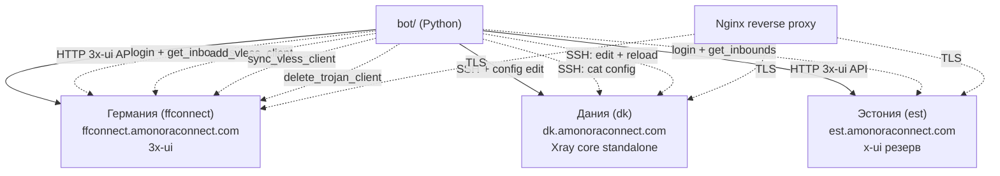
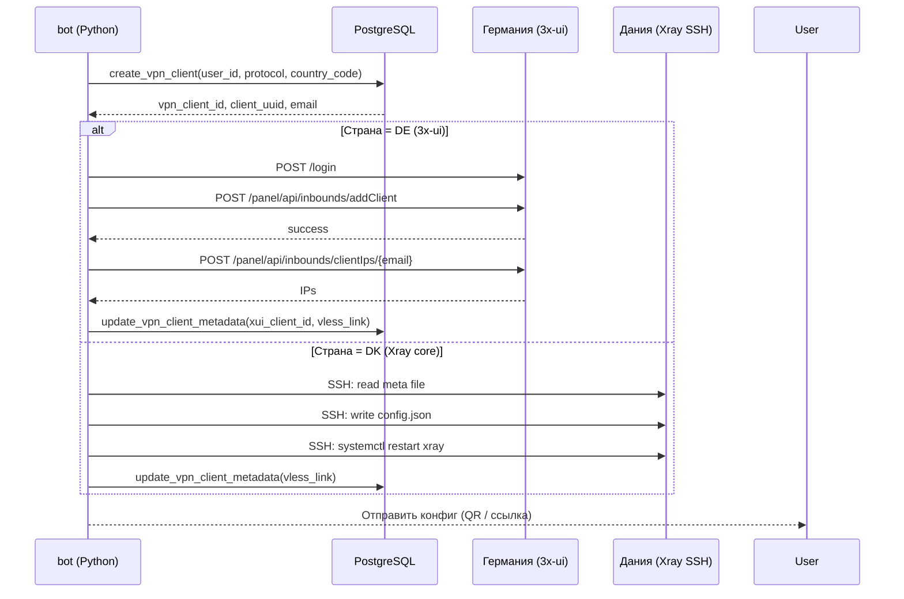

# VPN-ноды

## Обзор

VPN-ноды вынесены на отдельные серверы. На них **не живут**: боты, dashboard, PostgreSQL.
Бэкенд общается с нодами через HTTP API (3x-ui) и SSH (Xray core).



---

## 1. Германия (ffconnect) — 3x-ui

**Хост:** `ffconnect.amonoraconnect.com`
**Env:** `VPN_HOST_DE`, `XUI_URL_DE`
**Runtime:** 3x-ui panel
**Протоколы:** VLESS, Trojan

### Доступ

- **Панель:** HTTP API через `XUI_URL_DE` (по умолчанию `http://127.0.0.1:12053`)
- **Авторизация:** `XUI_USERNAME` / `XUI_PASSWORD`
- **Tunnel:** `ops/systemd/amonora-xui-tunnel.service` — SSH-туннель к панели

### Как бот взаимодействует

Класс `XUIClient` (`bot/vpn_api.py`):

```python
client = XUIClient(country_code="de")
await client.login()  # POST /login
await client.get_inbounds()  # GET /panel/api/inbounds/list
await client.add_vless_client(inbound_id, email, client_uuid, expiry_time_ms)
await client.sync_vless_client_expiry(inbound_id, client_uuid, email, expiry_time_ms)
```

Provisioner `XUIProvisioner` (`bot/vpn_provisioning.py`):

```python
provisioner = get_vless_provisioner("de", "xui")
await provisioner.provision_vless_client(
    user_id=..., email=..., access_expires_at=..., save_callback=...
)
# Возвращает VlessProvisionedClient с metadata (vless_link, QR и т.д.)
```

### Параметры клиента

| Параметр | Значение |
|----------|----------|
| `limitIp` | `VPN_MAX_DEVICES_PER_KEY` (по умолчанию 1) |
| `totalGB` | 0 (безлимит) |
| `flow` | "" (XTLS flow не используется по умолчанию) |
| `expiryTime` | миллисекунды до `subscription_expires_at` |

---

## 2. Дания (dk) — Xray core

**Хост:** `dk.amonoraconnect.com`
**Env:** `VPN_HOST_DK`, `XRAY_CORE_DK_*`
**Runtime:** Xray core standalone (без 3x-ui)
**Протоколы:** VLESS (XHTTP, Reality)

### Доступ

- **SSH:** `XRAY_CORE_DK_SSH_HOST` (81.17.159.58), порт 22
- **Пользователь:** `XRAY_CORE_DK_SSH_USER` (root)
- **Ключ:** `XRAY_CORE_DK_SSH_KEY_PATH` (/opt/amonora_bot/.ssh/dashboard_metrics)
- **Config:** `XRAY_CORE_DK_CONFIG_PATH` (/usr/local/etc/xray/config.json)
- **Meta:** `XRAY_CORE_DK_META_PATH` (/usr/local/etc/xray/amonora_dk_meta.json)

### Meta-файл (`amonora_dk_meta.json`)

Содержит конфигурацию профилей:

```json
{
  "active_profile": "primary",
  "profiles": {
    "primary": {
      "port": 443,
      "reality_server_name": "...",
      "reality_short_id": "...",
      "reality_public_key": "...",
      "xhttp_path": "/...",
      "stream_network": "xhttp",
      "transport_label": "XHTTP",
      "fingerprint": "chrome"
    },
    "reserve": {
      "..." : "fallback профиль"
    }
  },
  "mtu_default": 1400,
  "mtu_fallback": 1420,
  "dns_servers": ["1.1.1.1", "8.8.8.8"]
}
```

### Как бот взаимодействует

Класс `XrayCoreProvisioner` (`bot/vpn_provisioning.py`):

1. **SSH** к серверу через `asyncssh`
2. Чтение meta-файла: `cat /usr/local/etc/xray/amonora_dk_meta.json`
3. Генерация VLESS-конфига с Reality + XHTTP
4. Запись конфига: `tee /usr/local/etc/xray/config.json`
5. Перезапуск: `systemctl restart xray`

```python
provisioner = get_vless_provisioner("dk", "xray_core")
await provisioner.provision_vless_client(
    user_id=..., email=..., access_expires_at=..., save_callback=...
)
```

### MTU Enforcer

- Сервис: `ops/systemd/amonora-dk-mtg.service`
- Контролирует MTU на интерфейсе

### Single-IP Enforcer

- Сервис: `ops/systemd/amonora-dk-single-ip-enforcer.service`
- Таймер: `amonora-dk-single-ip-enforcer.timer`
- Обеспечивает лимит IP на клиента

---

## 3. Эстония (est) — Резерв

**Хост:** `est.amonoraconnect.com`
**Env:** `VPN_HOST_EE`, `XUI_URL_EE`
**Runtime:** x-ui / Xray
**Статус:** Скрытый reserve-регион

### Доступ

- **Панель:** `XUI_URL_EE` (по умолчанию `http://127.0.0.1:12054/dashboard`)
- **Авторизация:** `XUI_USERNAME_EE` / `XUI_PASSWORD_EE`

### Особенности

- Регион помечен как `is_retired_region` в `bot/utils/regions.py`
- При создании устройства проверяется capacity (CPU, memory, disk, load average)
- Если сервер перегружен — возвращается ошибка: "Сервер Эстония сейчас перегружен. Попробуй Германию."
- Region soft limit: проверяет активные устройства + метрики хоста

---

## Как бэкенд общается с нодами

### XUIClient (3x-ui ноды: DE, EE)

| Метод | HTTP | Описание |
|-------|------|----------|
| `login()` | POST /login | Авторизация в панели |
| `get_inbounds()` | GET /panel/api/inbounds/list | Список inbound'ов |
| `find_inbound(protocol)` | — | Найти inbound по протоколу |
| `add_vless_client()` | POST /panel/api/inbounds/addClient | Добавить VLESS клиента |
| `add_trojan_client()` | POST /panel/api/inbounds/addClient | Добавить Trojan клиента |
| `sync_vless_client_expiry()` | POST /panel/api/inbounds/updateClient | Обновить срок |
| `sync_trojan_client_expiry()` | POST /panel/api/inbounds/updateClient | Обновить срок |
| `delete_client()` | POST /panel/api/inbounds/delClient | Удалить клиента |
| `get_client_ips()` | POST /panel/api/inbounds/clientIps/{email} | Получить IP клиента |

### XrayCoreProvisioner (Дания)

| Операция | SSH-команда |
|----------|-------------|
| Read meta | `cat /usr/local/etc/xray/amonora_dk_meta.json` |
| Write config | `tee /usr/local/etc/xray/config.json` |
| Restart | `systemctl restart xray` |
| Check | `systemctl is-active xray` |

### Flow provisioning



### Синхронизация доступа (post-payment)

Функция `sync_user_vpn_access(user_id, expires_at)` в `bot/payment_flow.py`:

1. Получает все VpnClient пользователя
2. Для каждого клиента:
   - VLESS → `provisioner.sync_vless_client()` (обновить expiry_time на ноде)
   - Trojan → `xui_client.sync_trojan_client_expiry()`
3. Синхронизирует `public_subscription_routes` (публичные ссылки)
4. Если ошибка → `mark_vpn_repair_needed(user_id, reason)`

### Compensation / Retry

`bot/device_compensation.py` — асинхронные задачи компенсации:

| Action | Описание |
|--------|----------|
| `cleanup_created_device` | Удалить частично созданное устройство при сбое |
| `finalize_created_device` | Завершить создание если provisioning частично успешен |
| `restore_deleted_device` | Восстановить удалённое устройство при сбое |

Max attempts: 10, backoff: `attempt * 5 минут` (max 60 минут), stale lock: 900 секунд.

---

## systemd сервисы (VPN-ноды)

| Сервис | Описание |
|--------|----------|
| `amonora-xui-tunnel.service` | SSH-туннель к 3x-ui панелям |
| `amonora-dk-mtg.service` | MTU enforcement для Дании |
| `amonora-dk-single-ip-enforcer.service` | Single-IP limit enforcement |
| `amonora-dk-single-ip-enforcer.timer` | Таймер запуска enforcer |
| `amonora-server-watchdog.service` | Health-check серверов |
| `amonora-server-watchdog.timer` | Таймер watchdog |

## Nginx конфигурации

Файлы: `ops/nginx/*.conf`

Nginx выступает как reverse proxy для:
- VPN-трафика (VLESS/Trojan/WireGuard) к нодам
- HTTPS terminates
- WebSocket upgrade для VLESS

---

## Тарифы VPN-устройств

| Параметр | Значение |
|----------|----------|
| `VPN_MAX_DEVICES_PER_KEY` | 1 (IP limit per client) |
| `VPN_ANTISHARING_LEASE_SECONDS` | 180 |
| `VPN_ANTISHARING_SOFT_LIMIT_ENABLED` | 1 (true) |
| Базовый лимит устройств | 3 (`DEFAULT_DEVICE_LIMIT`) |
| Максимум доп. слотов | 5 (`DEVICE_SLOT_MAX_EXTRA_SLOTS`) |
| Цена доп. слота | 49 RUB (`DEVICE_SLOT_UNIT_PRICE_RUB`) |
