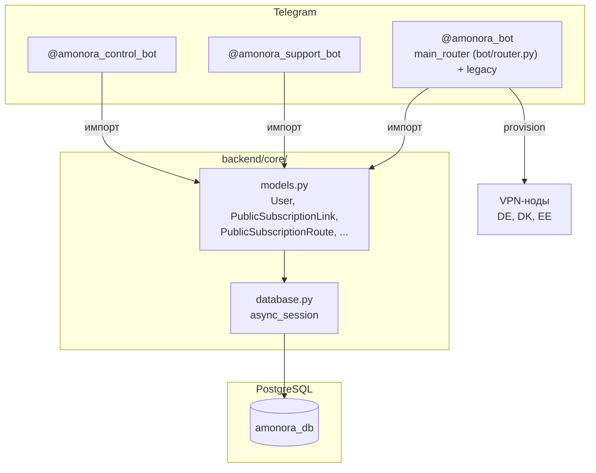

# Telegram-боты

## Обзор

В системе Amonora работают **4 бота**, каждый — отдельный Python-процесс (systemd service). Основной бот (`@amonora_bot`) имеет свой собственный UI-роутер (`bot/router.py`) и не зависит от тестового бота.

Все боты построены на **aiogram 3.x** (Python 3.12) и используют общую конфигурацию из `bot/config.py`. Состояние не хранится в ботах — все данные через общую PostgreSQL базу.

---

## 1. @amonora_bot — клиентский бот

**Главный продукт.** Основной интерфейс клиентов. Использует собственный UI-роутер (`bot/router.py`): единая подписка, trial, оплата, рефералы, баланс.

### Архитектура: двухслойный роутинг

```python
# bot/main.py
dp.include_router(main_router)     # bot/router.py — ПЕРВЫЙ, перехватывает ВСЁ
dp.include_router(start_router)    # bot/handlers/start.py — legacy (недостижим)
dp.include_router(cabinet_router)  # bot/handlers/cabinet.py — legacy
dp.include_router(devices_router)  # bot/handlers/devices.py — legacy
dp.include_router(protocol_router) # bot/handlers/protocol.py — legacy
dp.include_router(info_router)
dp.include_router(referrals_router)
dp.include_router(support_router)
dp.include_router(tariffs_router)
```

**`main_router`** из `bot/router.py` (~4785 строк) подключён **первым** и перехватывает все пользовательские взаимодействия. Legacy-обработчики из `bot/handlers/` **недостижимы** для обычных пользователей, но сохраняются как shared-логика для dashboard.

### Технологии
- **aiogram 3.x** — Telegram Bot API
- **httpx** — HTTP-клиент для VPN API и платёжных систем
- **SQLAlchemy 2.0 + asyncpg** — доступ к PostgreSQL
- **pillow, qrcode** — генерация QR-кодов

### Структура файлов

| Директория | Что внутри |
|------------|-----------|
| `main.py` | Точка входа, регистрация роутеров (**v2_router первым!**), запуск polling |
| `config.py` | Конфигурация из ENV-переменных |
| `handlers/` | Legacy-обработчики (shared-логика для dashboard) |
| `keyboards/` | Legacy-клавиатуры (не используются в v2-flow) |
| `middlewares/` | Middleware: `activity.py` — логирование активности |
| `utils/` | Утилиты: тарифы, тексты, регионы, QR, рефералы, слоты, доступ, VLESS |
| `public_subscription.py` | **Ключевой файл:** логика unified subscription (токены, routes, sync, Happ feed) |
| `payment_flow.py` | **Ключевой файл:** полный цикл оплаты — активация подписки, reconciliation, реферальные награды |
| `platega_flow.py` | Интеграция с Platega (SBP, крипто) |
| `crypto_pay.py` | Интеграция с Crypto Pay (TON, USDT) |
| `db.py` | Функции доступа к БД: пользователи, платежи, устройства, public subscription |

### Основной роутер (`bot/router.py`)

**Главное меню** (`_main_menu_keyboard`):
```
┌────────────────────────────────────────────┐
│ [Моя подписка]      [Ключ]                 │
│ [Продлить]          [Информация]           │
│ [Поддержка]         [Бонусная система]      │
└────────────────────────────────────────────┘
```

**Onboarding нового пользователя:**
```
/start → Соглашение → [Принимаю] → Trial intro → [Проверить подписку]
  → Проверка подписки на @amonora_new
  → activate_trial (3 дня)
  → Готово: [Ключ] [Инструкция] [Поддержка]
```

**Экран «Ключ»** (единая ссылка):
```
┌─────────────────────────────────────────────────────────┐
│ [Подписка URL]            [Happ URL]                    │
│ [📋 Скопировать — CopyTextButton]                       │
│ [Мои устройства]                                        │
│ [Назад]                                                 │
└─────────────────────────────────────────────────────────┘
```

**Система экранов** — каждое состояние = фото (из `test_bot/assets/v2/sakura_<key>.jpg`) + текст (HTML) + inline-клавиатура. Функции `_send_screen` (новое сообщение) и `_edit_screen` (редактирование существующего).

### Платёжные методы

| Метод | Тип | Конфиг |
|-------|-----|--------|
| Platega SBP (авто) | Авто | `PLATEGA_MERCHANT_ID`, `PLATEGA_SECRET_KEY` |
| Platega Crypto (авто) | Авто | `PLATEGA_MERCHANT_ID` |
| Manual SBP | Ручная | `MANUAL_SBP_DETAILS` |
| Manual Crypto | Ручная | `MANUAL_CRYPTO_DETAILS` |
| Telegram Stars | Авто | `STARS_PROVIDER_TOKEN` |
| Crypto Pay | Авто | `CRYPTO_PAY_API_TOKEN` |
| Баланс (RUB) | Авто | — |

### Как взаимодействует с backend

Клиентский бот импортирует `backend.core` напрямую (in-process):
- `backend.core.models` — модели (User, VpnClient, PublicSubscriptionLink, PublicSubscriptionRoute, PaymentRecord и т.д.)
- `backend.core.database` — async_session
- `backend.core.schema` — `ensure_schema()` при старте
- `backend.core.analytics` — эмиссия событий атрибуции

### Legacy-обработчики — статус

| Handler | Статус | Примечание |
|---------|--------|------------|
| `start.py` | Перехвачен | `/start` и `/menu` обрабатываются main_router |
| `cabinet.py` | Перехвачен | `home:cabinet` → v2_main_menu_callback |
| `devices.py` | Перехвачен | `home:devices` → v2_my_devices_callback |
| `protocol.py` | Перехвачен | Не используется в v2-flow |
| `info.py` | Частично | Некоторые кнопки могут доходить |
| `referrals.py` | Перехвачен | `home:referrals` → v2_bonus_callback |
| `support.py` | Частично | v2 перенаправляет на support_bot URL |
| `tariffs.py` | Частично | Shared payment layer, используется backend-логика |

---

## 2. @amonora_support_bot — бот поддержки

**Назначение:** Принимает обращения от клиентов, ведёт тикеты, операторы отвечают внутри бота.

### Структура файлов

| Файл | Описание |
|------|----------|
| `main.py` | Точка входа, регистрация роутера |
| `router.py` | Обработчики команд: тикеты, ответы, медиа |
| `storage.py` | Хранилище: состояние тикетов, операторов |

### Команды

| Команда | Описание |
|---------|----------|
| `/start` | Открыть поддержку |
| `/tickets` | Панель обращений |
| `/cancel` | Отменить текущий ответ |

### Как взаимодействует с backend

-读写 `support_tickets`, `support_ticket_messages` напрямую через SQLAlchemy
- **Не получает** auth-коды, payment review, node alerts — это зона control_bot
- Операторы назначаются через dashboard или control_bot

### Конфигурация

| Env-переменная | Описание |
|----------------|----------|
| `SUPPORT_BOT_TOKEN` | Токен бота |
| `SUPPORT_ADMIN_IDS` | ID операторов поддержки |

---

## 3. @amonora_control_bot — контрол-бот

**Назначение:** Системные уведомления, review платежей, коды входа в админку, рассылки, триггеры, node alerts.

### Структура файлов

| Файл | Описание |
|------|----------|
| `main.py` | Точка входа, daily summary loop |
| `router.py` | Маршруты команд |
| `dispatcher.py` | Создание control-событий, отправка auth-кодов |
| `messaging.py` | Отправка сообщений |
| `keyboards.py` | Клавиатуры контрол-бота |
| `queries.py` | SQL-запросы |
| `access.py` | Проверка доступа (allowlist) |
| `storage.py` | Хранилище: настройки уведомлений, предпочтения |

### Ключевые команды

| Команда | Описание |
|---------|----------|
| `/start` | Открыть Amonora Control |
| `/status` | Статус системы |
| `/nodes` | Список нод |
| `/payments` | Платежи (review ручных оплат) |
| `/users` | Пользователи |
| `/broadcast` | Рассылка и триггеры |
| `/settings` | Настройки уведомлений |

### Роли в control_bot

| Роль | Env-переменная | Описание |
|------|----------------|----------|
| Owner | `AMONORA_CONTROL_OWNER_IDS` | Полный доступ |
| Admin | `AMONORA_CONTROL_ADMIN_IDS` | Управление пользователями, платежами |
| Operator | `AMONORA_CONTROL_OPERATOR_IDS` | Операционные задачи |
| Support (view-only) | `AMONORA_CONTROL_SUPPORT_VIEW_ONLY_IDS` | Только просмотр тикетов |

### Категории уведомлений

| Категория | Severity | Описание |
|-----------|----------|----------|
| `access` | WARNING/CRITICAL | Проблемы с VPN-доступом |
| `payments` | INFO/WARNING | Платежи, review |
| `system` | INFO/WARNING/CRITICAL | Системные события |
| `nodes` | WARNING/CRITICAL | Alerts нод |

---

## 4. @test_amonora_bot — тестовый бот

**Назначение:** Admin-only бот для проверки мобильных профилей. Отдаёт 8 тестовых конфигов (Germany, Denmark, Estonia) только разрешённым Telegram ID.

**Важно:** Работает **независимо** от основного бота. Имеет свой `test_bot/router.py` и свой собственный роутер. Исходный код основного бота находится в `bot/router.py`.

### Структура файлов

| Файл | Описание |
|------|----------|
| `main.py` | Точка входа |
| `router.py` | Свой UI-роутер: тестовые профили, admin-only доступ |
| `profiles.py` | Генерация тестовых конфигов |
| `device_binding.py` | Привязка устройств |
| `access.py` | Проверка доступа (allowlist) |
| `assets/v2/` | Картинки для экранов бота |

### Конфигурация

| Env-переменная | Описание |
|----------------|----------|
| `TEST_BOT_TOKEN` | Токен тестового бота |
| `ADMIN_IDS` | Разрешённые Telegram ID |

---

## Общая схема взаимодействия



**Ключевой принцип:** Все боты — отдельные Python-процессы (systemd services), но разделяют общую кодовую базу `backend/core/` и единую PostgreSQL базу. Боты не общаются друг с другом напрямую — вся координация через БД.
