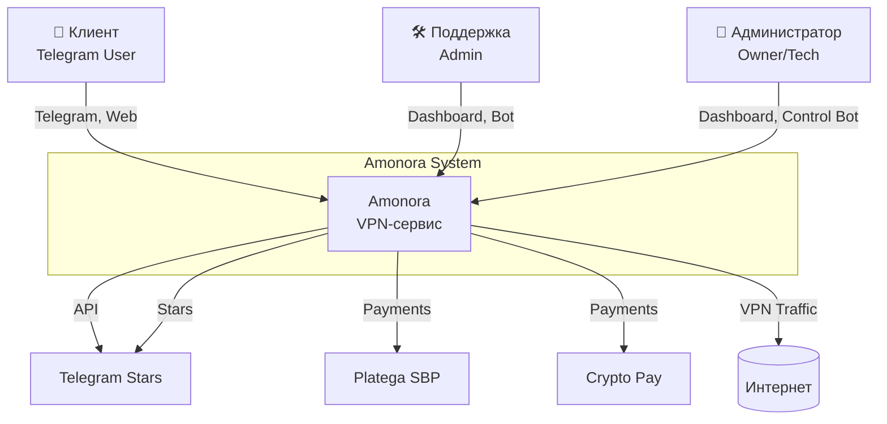
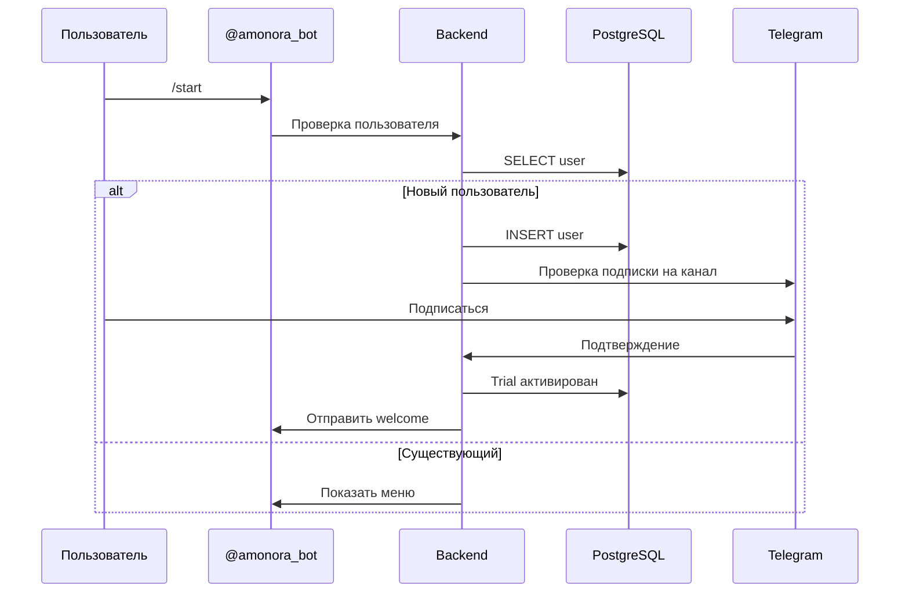
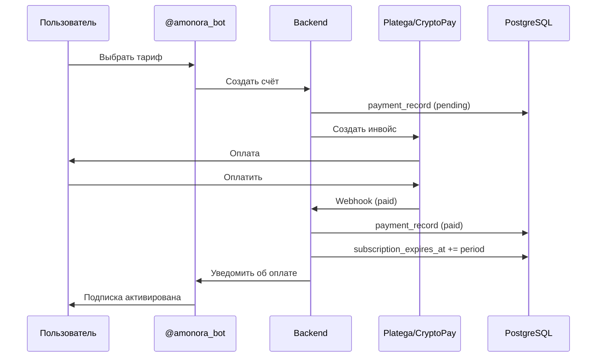
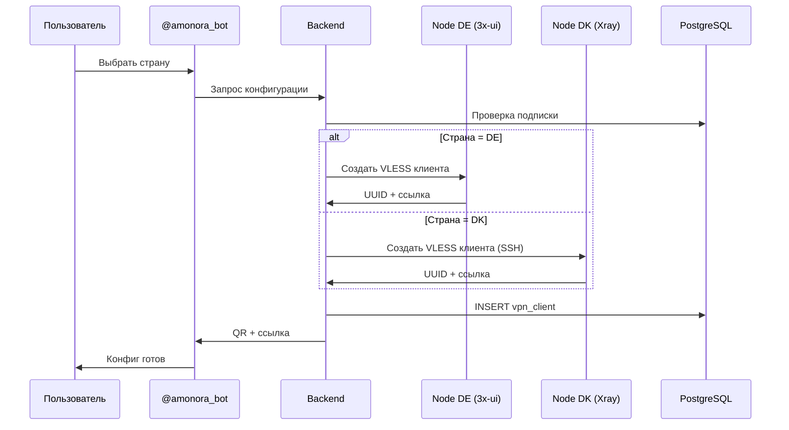

# 🏗️ Общая схема архитектуры Amonora

C4-диаграмма архитектуры системы (уровни: Context и Containers).

---

## 📊 C4 Level 1: Контекст системы



**Границы системы:**
- **Внутри:** Боты, Dashboard, база данных, VPN-ноды, аналитика
- **Снаружи:** Пользователи, Telegram, платёжные провайдеры, интернет

---

## 📦 C4 Level 2: Контейнеры

```mermaid
graph TB
    subgraph "Frontend Layer"
        Bot[@amonora_bot<br/>aiogram 3]
        SupportBot[@amonora_support_bot<br/>aiogram 3]
        ControlBot[@amonora_control_bot<br/>aiogram 3]
        DashboardUI[Dashboard UI<br/>Next.js 15]
        Landing[Landing Page<br/>Next.js]
    end
    
    subgraph "Backend Layer"
        Backend[Backend Core<br/>FastAPI + SQLAlchemy]
        Analytics[Analytics Engine<br/>Python]
    end
    
    subgraph "Data Layer"
        PostgreSQL[(PostgreSQL<br/>БД)]
    end
    
    subgraph "Infrastructure"
        DE[VPN Node DE<br/>3x-ui]
        DK[VPN Node DK<br/>Xray Core]
        Grafana[Grafana<br/>Мониторинг]
        n8n[n8n<br/>Автоматизация]
    end
    
    User --> Bot
    User --> SupportBot
    Admin --> ControlBot
    Admin --> DashboardUI
    
    Bot --> Backend
    SupportBot --> Backend
    ControlBot --> Backend
    DashboardUI --> Backend
    
    Backend --> PostgreSQL
    Analytics --> PostgreSQL
    
    Backend --> DE
    Backend --> DK
    
    DE --> Internet
    DK --> Internet
    
    Grafana --> PostgreSQL
    n8n --> Backend
```

---

## 🔧 Компоненты системы

### 1. Telegram-боты

| Бот | Технология | Назначение |
|-----|------------|------------|
| **@amonora_bot** | aiogram 3.x | Основной клиентский бот |
| **@amonora_support_bot** | aiogram 3.x | Бот поддержки |
| **@amonora_control_bot** | aiogram 3.x | Уведомления для админов |
| **@test_amonora_bot** | aiogram 3.x | Тестовый бот (admin-only) |

**Файлы:**
- `bot/main.py` — точка входа клиентского бота
- `support_bot/` — бот поддержки
- `control_bot/` — контрол-бот
- `test_bot/` — тестовый бот

---

### 2. Backend Core

**Технологии:** Python 3.12+, FastAPI, SQLAlchemy (async)

**Основные модули:**
- `backend/core/models.py` — ORM-модели (40+ таблиц)
- `backend/core/schema.py` — миграции БД
- `backend/core/analytics.py` — аналитический движок
- `backend/core/promo_codes.py` — логика промокодов

**Функции:**
- Управление пользователями и подписками
- Проведение платежей
- Выдача VPN-конфигураций
- Сбор аналитики

---

### 3. Dashboard (Веб-панель)

**Технологии:** 
- Backend: FastAPI
- Frontend: Next.js 15, React, Tailwind CSS

**Компоненты:**
- `dashboard/main.py` — бэкенд админки
- `dashboard/ui/` — фронтенд на Next.js
- `dashboard/services.py` — бизнес-логика
- `dashboard/analytics.py` — отчёты и метрики

**Возможности:**
- Управление пользователями
- Обработка тикетов поддержки
- Финансы и аналитика
- Мониторинг нод
- Настройка тарифов

---

### 4. База данных (PostgreSQL)

**Версия:** PostgreSQL 16+

**Ключевые таблицы:**

| Группа | Таблицы |
|--------|---------|
| **Пользователи** | `users`, `referrals`, `referral_rewards` |
| **VPN** | `vpn_clients`, `vpn_client_activations`, `device_slot_entitlements` |
| **Платежи** | `payment_records`, `user_balance_events` |
| **Поддержка** | `support_tickets`, `support_ticket_messages` |
| **Промокоды** | `promo_codes`, `promo_code_usages` |
| **Аналитика** | `analytics_events`, `analytics_daily_*`, `user_attribution` |
| **Контент** | `channel_content_items`, `daily_news_review_items` |
| **Служебные** | `user_deletion_jobs`, `device_compensation_jobs`, `vpn_repair_events` |

**Файлы:**
- `backend/core/models.py` — все модели
- `backend/core/schema.py` — создание таблиц

---

### 5. VPN-ноды

#### Германия (DE)
- **Тип:** 3x-ui панель
- **Протокол:** VLESS
- **URL:** `XUI_URL_DE` (порт 12053)
- **Хост:** `ffconnect.amonoraconnect.com`

#### Дания (DK)
- **Тип:** Xray Core
- **Протокол:** VLESS
- **SSH:** `81.17.159.58:22`
- **Хост:** `dk.amonoraconnect.com`

#### Эстония (EE) — устарела
- **Статус:** ⚠️ Retired
- **Требуется:** Миграция пользователей в DE/DK

**Управление:**
- `ops/vpn_regions.py` — синхронизация регионов
- `bot/vpn_api.py` — XUIClient для 3x-ui
- `bot/vpn_provisioning.py` — XrayCoreProvisioner для DK

---

### 6. Мониторинг (Grafana)

**Дашборды:**
- `amonora-home.json` — общая сводка
- `revenue.json` — выручка и платежи
- `retention-churn.json` — удержание и отток
- `channel-funnel.json` — воронка по каналам
- `connection-quality.json` — качество подключений
- `alerts-incidents.json` — инциденты и алерты
- `ops-repair.json` — ремонты доступов
- `source-performance.json` — эффективность источников

**Алерты:**
- `amonora-rules.yaml` — правила алертов
- `amonora-contact-points.yaml` — куда отправлять
- `amonora-notification-policies.yaml` — политики уведомлений

---

### 7. Автоматизация (n8n)

**Workflow'ы:**
- `generate_due_channel_drafts.json` — генерация черновиков постов
- `remind_missing_channel_content.json` — напоминания о контенте
- `publish_approved_channel_posts.json` — публикация одобренных постов
- `amonora_daily_news_generate.json` — генерация ежедневных новостей
- `amonora_daily_news_approval.json` — модерация новостей

---

## 🔄 Потоки данных

### Поток 1: Регистрация пользователя



### Поток 2: Оплата подписки



### Поток 3: Выдача VPN-ключа



---

## 📁 Структура репозитория

```
/workspace/
├── backend/           # Общее ядро: модели, схема БД
│   └── core/
│       ├── models.py      # 40+ таблиц
│       ├── schema.py      # Миграции
│       ├── analytics.py   # Аналитика
│       └── database.py    # DB connection
│
├── bot/               # Клиентский бот (aiogram 3)
│   ├── main.py
│   ├── handlers/      # Обработчики команд
│   ├── keyboards/     # Клавиатуры
│   ├── utils/         # Утилиты
│   └── config.py      # Конфигурация
│
├── support_bot/       # Бот поддержки
├── control_bot/       # Бот управления
├── test_bot/          # Тестовый бот
│
├── dashboard/         # Backend админки + API
│   ├── main.py
│   ├── ui/            # Next.js frontend
│   ├── services.py    # Бизнес-логика
│   └── analytics.py   # Отчёты
│
├── landing/           # Публичный сайт
│
├── ops/               # Инфраструктура
│   ├── grafana/       # Дашборды и алерты
│   ├── n8n/           # Workflow автоматизации
│   ├── backup/        # Скрипты бэкапов
│   └── vpn_regions.py # Синхронизация нод
│
├── tests/             # Тесты (135+ файлов)
│
└── docs/              # Документация (эта папка)
```

---

## 🔐 Безопасность

### Границы доверия

| Зона | Доступ |
|------|--------|
| **Публичная** | Сайт, клиентский бот, страница подписки |
| **Пользовательская** | Личный кабинет, тикеты поддержки |
| **Админская** | Dashboard, контрол-бот, Grafana |
| **Инфраструктурная** | VPN-ноды, база данных, SSH |

### Защита данных

- Пароли хешируются (bcrypt)
- Сессионные куки с HttpOnly + Secure
- Webhook secret для проверки платежей
- Rate limiting на критичных эндпоинтах
- Изоляция нод через firewall

---

## 📈 Масштабируемость

### Горизонтальное масштабирование

- ✅ Боты — stateless, можно запускать несколько инстансов
- ✅ Dashboard — отдельные backend/frontend
- ✅ Аналитика — асинхронные джобы

### Вертикальное масштабирование

- ✅ PostgreSQL — репликация, шардирование
- ✅ VPN-ноды — добавление новых серверов по странам

### Точки роста

1. **Новые страны** — добавить код региона в `ops/vpn_regions.py`
2. **Новые протоколы** — расширить `bot/vpn_provisioning.py`
3. **Новые платежи** — подключить провайдера через webhook

---

**Версия схемы:** 1.0  
**Последнее обновление:** Апрель 2025  
**Статус:** ✅ Актуально
