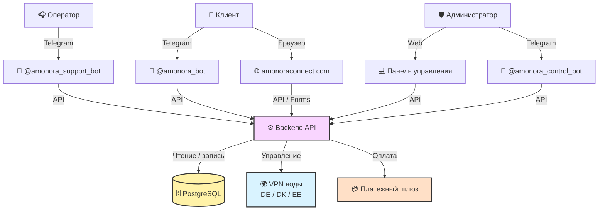
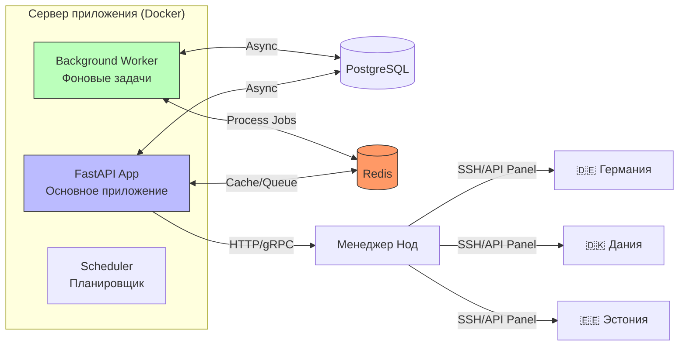
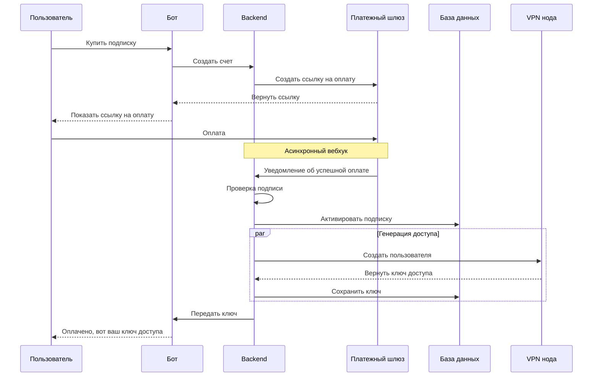

# 🏗️ Общая схема архитектуры

Этот документ описывает, как устроена система Amonora изнутри. Мы используем подход **C4** (Context, Containers, Components), чтобы показать систему от общего вида до деталей.

## 1. Контекст системы (C4 Level 1)

_Как система выглядит снаружи и кто с ней взаимодействует._

**Ключевые связи:**

- Пользователь **никогда** не касается базы данных или серверов напрямую. Всё идет через Бота.
- **Backend API** — это единый центр управления. Все боты и панель просто «экраны», которые показывают данные из бэкенда.
- **VPN Ноды** изолированы. Бэкенд управляет ими удаленно, но пользовательский трафик идет напрямую на ноду, минуя наш сервер (для скорости).

---

## 2. Контейнеры (C4 Level 2)

_Из чего состоит внутренняя часть системы (Backend)._

**Описание компонентов:**

1. **FastAPI App**: Обрабатывает входящие запросы от ботов (нажатия кнопок, оплаты). Отвечает мгновенно.
2. **Worker**: Выполняет тяжелые задачи в фоне, чтобы не тормозить бота.
    - _Примеры:_ Генерация ключей для 100 пользователей, рассылка уведомлений об окончании подписки, проверка статусов платежей.
3. **Redis**: Служит очередью задач для воркера и кэшем для частых запросов.
4. **Менеджер Нод**: Специальный модуль, который знает, как общаться с разными типами панелей на серверах (3x-ui, Xray).

---

## 3. Ключевые потоки данных (Сценарии)

### Сценарий А: Оплата и активация

_Как деньги превращаются в доступ к интернету._

### Сценарий Б: Подключение устройства

_Как пользователь получает интернет._

1. Пользователь жмет **«Подключить»** в боте.
2. **Backend** проверяет активную подписку.
3. **Backend** выбирает наименее загруженную ноду (например, Германию).
4. Если ключ уже есть — отправляет его сразу.
5. Если ключа нет — запрашивает создание у **Ноды** → Получает ссылку → Отправляет пользователю + QR-код.
6. Пользователь сканирует QR в приложении (V2Ray/Streisand) → **Интернет работает**.

---

## 4. Технологический стек

|Уровень|Технология|Зачем нужно|
|---|---|---|
|**Frontend (Бот)**|Python + Aiogram 3|Быстрое и асинхронное общение с Telegram API.|
|**Frontend (Web)**|Next.js + React|Современная, быстрая панель администратора.|
|**Backend**|Python + FastAPI|Высокая скорость работы API, автоматическая документация.|
|**База данных**|PostgreSQL 14+|Надежное хранение финансовых данных и связей.|
|**ORM**|SQLAlchemy (Async)|Удобная работа с базой данных из кода.|
|**Очереди**|Redis + ARQ/Celery|Фоновая обработка задач без задержек.|
|**VPN Ядро**|Xray Core / 3x-ui|Современные протоколы (VLESS, Reality) для обхода блокировок.|
|**Инфраструктура**|Docker + Systemd|Изоляция сервисов и легкий перезапуск при сбоях.|
|**Мониторинг**|Grafana + Prometheus|Визуализация нагрузки, свободной памяти и активных пользователей.|

---

## 5. Безопасность и Сеть

- **Периметр**: Внешний мир видит только порты Telegram (исходящие) и порты HTTPS (для сайта/вебхуков).
- **Внутренняя сеть**: Бэкенд, База данных и Redis общаются внутри закрытой Docker-сети. Прямой доступ из интернета к базе данных **запрещен**.
- **Доступ к нодам**: Осуществляется только по SSH-ключам (без паролей) с конкретного IP-адреса бэкенда.
- **Данные**: Пароли и токены хранятся в переменных окружения (`.env`), а не в коде.

> 💡 **Совет разработчику**: Если вы добавляете новый сервис, обязательно пропишите его в `docker-compose.yml` и закройте лишние порты в фаерволе (`ufw`).