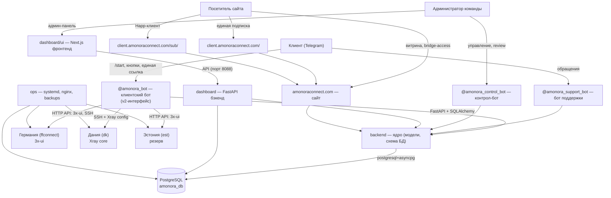
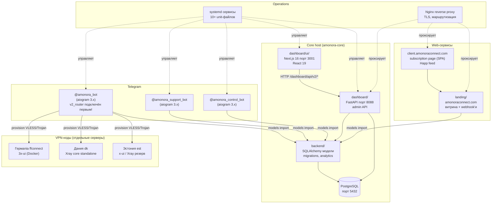

# Общая схема архитектуры Amonora

## Диаграмма контекста (C4 — Context)



## Диаграмма контейнеров



## Ключевая архитектурная особенность: v2_router

Основной бот (`bot/main.py`) использует **двухслойную архитектуру**:

```python
dp.include_router(main_router)   # bot/router.py — основной UI-роутер
dp.include_router(start_router)  # bot/handlers/start.py — legacy
dp.include_router(cabinet_router) # bot/handlers/cabinet.py — legacy
dp.include_router(devices_router) # bot/handlers/devices.py — legacy
dp.include_router(protocol_router) # bot/handlers/protocol.py — legacy
# ... остальные legacy-роутеры
```

**`main_router`** (из `bot/router.py`, ~4900 строк) подключён **первым** и перехватывает все пользовательские взаимодействия:

- `/start` → v2_start_handler
- `/menu` → v2_menu_handler
- `home:*` callback'и → v2_*_callback

**Legacy-обработчики** (`bot/handlers/`) **недостижимы** для обычных пользователей, но сохраняются как shared-логика для dashboard и внутренних вызовов.

## Система экранов v2-интерфейса

Каждое состояние UI — это пара **(фото + текст + клавиатура)**, идентифицируемая `screen_key`:

| screen_key | Описание | Кнопки |
|------------|----------|--------|
| `agreement` | Пользовательское соглашение | [Ссылка на Terms] [Принимаю] |
| `trial` | Intro пробного периода | [Проверить подписку] |
| `main_menu` | Главное меню | [Моя подписка] [Ключ] [Продлить] [Информация] [Поддержка] [Бонусная система] |
| `my_subscription` | Статус подписки | [Открыть подписку URL] [Назад] |
| `key` | Экран единой ссылки | [Открыть подписку URL] [Открыть в Happ URL] [Скопировать ссылку] [Мои устройства] [Назад] |
| `renew` | Продление подписки | [1м—149₽] [3м—399₽] [6м—749₽] [12м—1390₽] [Баланс] [Назад] |
| `my_devices` | Список устройств | [Устройство 1] [Устройство 2] [Купить слот] [Назад] |
| `info` | Информация | [Инструкции] [Канал] [Назад] |
| `support` | Поддержка | [Перейти в бот поддержки URL] |
| `bonus` | Бонусная система | [Статистика] [Пригласить] [Промокод] [Подарить] [Назад] |

## Описание связей

| Связь | Протокол | Описание |
|-------|----------|----------|
| Клиент → `@amonora_bot` | Telegram Bot API | Основной интерфейс: trial, единая ссылка, оплата, рефералы |
| `@amonora_bot` → `backend` | Python import (in-process) | Модели через SQLAlchemy, asyncpg к PostgreSQL |
| `backend` → PostgreSQL | `postgresql+asyncpg` | Async-подключение, `async_sessionmaker` |
| `dashboard` → PostgreSQL | `postgresql+asyncpg` | Та же БД, отдельная схема (dashboard_admins, sessions) |
| `dashboard/ui` → `dashboard` | HTTP (порт 8088 → 3001) | Next.js App Router, `/dashboard/api/v2/*` REST API |
| `bot` → VPN-ноды | HTTP (3x-ui API) + SSH (Xray core) | Provisioning VLESS/Trojan клиентов, sync_public_subscription_access |
| `landing` → `client.amonoraconnect.com` | HTML + SPA | Subscription page для браузера, feed для Happ |
| Happ → `/sub/<token>` | Plain text | Subscription feed с connection URI всех серверов |
| `ops/systemd` → сервисы | systemctl | Запуск/перезапуск всех Python-сервисов |
| Nginx → сервисы | reverse proxy | TLS, маршрутизация внешнего трафика |

## Таблица компонентов

| Компонент | Путь | Технология | Роль |
|-----------|------|-----------|------|
| **backend/core** | `backend/core/` | SQLAlchemy + asyncpg | Модели: User, PublicSubscriptionLink, PublicSubscriptionRoute, Payment, VpnClient, SupportTicket, PromoCode |
| **bot** | `bot/` | aiogram 3.x, httpx | Основной UI-роутер (`router.py`), public_subscription, payment_flow, config |
| **test_bot** | `test_bot/` | aiogram 3.x | Тестовый бот (независимый), тестовые профили |
| **support_bot** | `support_bot/` | aiogram 3.x | Бот поддержки: тикеты, диалоги |
| **control_bot** | `control_bot/` | aiogram 3.x | Системный бот: уведомления, review платежей, рассылки |
| **dashboard** | `dashboard/` | FastAPI + Jinja2 | Admin backend: API, авторизация, сервисы |
| **dashboard/ui** | `dashboard/ui/` | Next.js 16, React 19 | Рабочий UI админки |
| **landing** | `landing/` | Python + Jinja2 | Витрина, bridge-access, Platega webhook, subscription page, Happ wrapper |
| **client_ui** | `client_ui/` | Vite + React + Mantine | Исходники tokenized client page (публикуется в `landing/static/client-app/`) |
| **ops** | `ops/` | systemd, bash, nginx | Запуск, бэкапы, мониторинг |

## Принцип архитектуры

**Modular monolith first** — одна связанная система, без микросервисов. PostgreSQL — единственный source of truth. Все интерфейсы (`bot`, `dashboard/ui`, `landing`, `client.amonoraconnect.com`) читают из одного ядра (`backend`).

**Единая подписка** — ключевое отличие от legacy-архитектуры. Клиент получает один токен, который включает все серверы (DE, DK, EE) автоматически. Happ-клиент получает subscription feed со всеми connection URI и выбирает оптимальный сервер.
