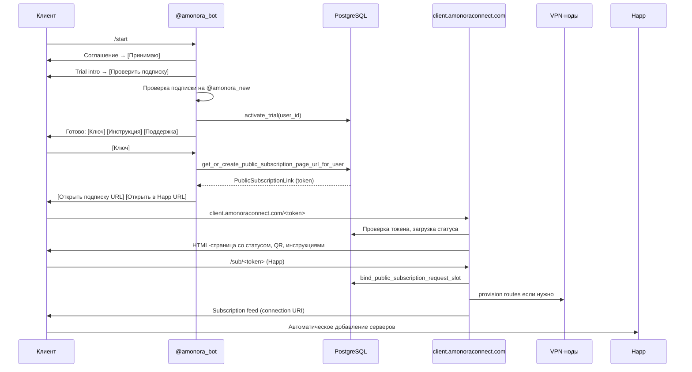
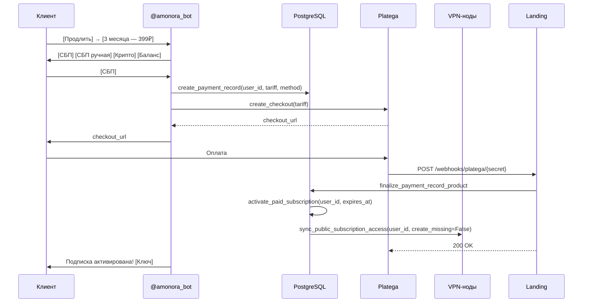

# Unified Subscription Flow — поток единой подписки

## Обзор

Единая подписка — **основной механизм доступа к VPN** в Amonora. Клиент получает один токен, который автоматически включает все серверы (Германия, Дания, Эстония) с failover-маршрутизацией. Клиент **не выбирает** страну, протокол или режим — это внутренняя логика системы.

## Компоненты потока

```
@amonora_bot → PublicSubscriptionLink (token)
                ↓
client.amonoraconnect.com/<token> → SPA (браузер)
/sub/<token> → subscription feed (Happ)
/happ/add?sub=<url> → Happ wrapper (deep link)
                ↓
PublicSubscriptionRoute (x country_code x slot_index)
                ↓
VPN-ноды (DE, DK, EE) — VLESS/Trojan clients
```

## Модели данных

### PublicSubscriptionLink

| Поле | Тип | Описание |
|------|-----|----------|
| `id` | int | Первичный ключ |
| `user_id` | int | FK → users.id |
| `token` | str(64) | URL-safe токен (~24 символа, base64) |
| `is_active` | bool | Активна ли ссылка |
| `created_at` | datetime | Дата создания |
| `updated_at` | datetime | Дата обновления |
| `last_viewed_at` | datetime | Последний просмотр страницы |
| `last_feed_accessed_at` | datetime | Последний доступ к feed |

Создаётся **один на пользователя** при первом вызове `get_or_create_public_subscription_page_url_for_user`.

### PublicSubscriptionRoute

| Поле | Тип | Описание |
|------|-----|----------|
| `id` | int | Первичный ключ |
| `user_id` | int | FK → users.id |
| `country_code` | str(10) | `de`, `dk`, `ee` |
| `slot_index` | int | Номер слота (1..N) |
| `protocol` | str(50) | `"vless"` (основной) |
| `client_uuid` | str(255) | Уникальный UUID клиента |
| `email` | str(255) | Email для VPN-панели |
| `xui_client_id` | str(255) | ID клиента в 3x-ui (nullable) |
| `client_data` | text (JSON) | Метаданные: vless_link, trojan_link, country_name, stream_network, provider_type, inbound_id |
| `status` | str(30) | `active` / `disabled` / `broken` |

Создаётся **по одному на каждую комбинацию** `(country_code, slot_index)`: de#1, de#2, de#3, dk#1, dk#2, dk#3, ee#1, ee#2, ee#3.

## Создание токена

```python
# bot/public_subscription.py
def generate_public_subscription_token() -> str:
    return secrets.token_urlsafe(18)  # ~24 символа
```

Токен генерируется **один раз на пользователя** и сохраняется в `PublicSubscriptionLink`. При последующих обращениях возвращается существующий токен.

## Генерация URL

| Тип | URL | Функция |
|-----|-----|---------|
| Subscription page | `https://client.amonoraconnect.com/<token>` | `build_public_subscription_page_url(token)` |
| Happ wrapper | `https://client.amonoraconnect.com/happ/add?sub=<page_url>` | `build_public_subscription_happ_wrapper_url()` |
| Happ deep link | `happ://add/<page_url>` | — |
| Subscription feed | `https://client.amonoraconnect.com/sub/<token>` | — |

## Провижининг маршрутов

### При первом обращении

Функция `sync_public_subscription_access(user_id, create_missing=True)`:

1. Определяет список стран: `PUBLIC_SUBSCRIPTION_COUNTRY_CODES = ("de", "dk", "ee")`
2. Определяет количество слотов: `N = effective_device_limit(user)` (по умолчанию 3)
3. Для каждой комбинации `(country_code, slot_index)`:
   - Вызывает `_provision_public_route(user, country_code, slot_index)`
   - Создаёт VLESS-клиента на VPN-ноде через 3x-ui API или Xray core
   - Сохраняет `PublicSubscriptionRoute` с `client_data` (JSON с vless_link, trojan_link и метаданными)

### При оплате

После подтверждения платежа (`finalize_subscription_payment`):
- Вызывается `sync_public_subscription_access(user_id, create_missing=False)`
- Существующие маршруты обновляются (новый expiry)
- Новые маршруты **не создаются** — используются существующие

### При обращении Happ-клиента

Happ делает запрос на `/sub/<token>` с User-Agent, содержащим `happ`:
1. Landing распознаёт Happ через `is_public_subscription_client_request`
2. Вызывает `bind_public_subscription_request_slot` — привязывает устройство к свободному слоту
3. Возвращает subscription feed — список всех connection URI

## Subscription page (браузер)

**URL:** `client.amonoraconnect.com/<token>`

**Что показывает SPA (React-приложение):**
- Статус подписки: активна / истекла / не активна
- Оставшиеся дни
- Тариф
- QR-код для подключения
- Инструкции по установке Happ для платформ:
  - Android → Google Play
  - iOS → App Store
  - Windows → GitHub Releases
  - macOS → GitHub Releases
  - Linux → GitHub Releases
  - Apple TV → App Store
  - Android TV → Google Play

**Технологии:** Vite + React + Mantine, исходники в `client_ui/`, публикуются в `landing/static/client-app/`.

## Subscription feed (Happ)

**URL:** `client.amonoraconnect.com/sub/<token>`

**Формат:** Plain text, один connection URI на строку. Happ автоматически парсит и добавляет серверы.

Содержит connection URI для всех активных `PublicSubscriptionRoute`:
- DE #1, DE #2, DE #3 (VLESS + Reality + TCP)
- DK #1, DK #2, DK #3 (VLESS + Reality + XHTTP)
- EE #1, EE #2, EE #3 (VLESS + Reality + TCP, reserve)

Happ автоматически выбирает оптимальный сервер на основе доступности и задержки.

## Happ wrapper

**URL:** `client.amonoraconnect.com/happ/add?sub=<page_url>`

**Что делает:**
1. Показывает страницу со ссылкой подписки
2. Через 180мс автоматически открывает `happ://add/<page_url>` (deep link)
3. Если Happ не установлен — показывает кнопки для скачивания

## Flow нового пользователя



## Flow оплаты



## Протоколы и режимы — внутренняя логика

Клиент **не выбирает** протокол или режим. Система определяет автоматически:

| Сервер | Основной протокол | Reserve протокол | Транспорт |
|--------|-------------------|------------------|-----------|
| Германия (3x-ui) | VLESS | Trojan | Reality + TCP |
| Дания (Xray core) | VLESS | VLESS | Reality + XHTTP |
| Эстония (x-ui) | VLESS | Trojan | Reality + TCP |

В `client_data` каждой `PublicSubscriptionRoute` сохраняются **обе ссылки** (vless_link и trojan_link), но Happ использует основную.

## Ограничения

- **Токен** — один на пользователя. При компрометации — ротация через `rotate_public_subscription_token`.
- **Слоты** — по умолчанию 3, максимум 8 (с доп. покупкой).
- **Failover** — Happ автоматически переключается на доступный сервер.
- **Expired подписка** — маршруты деактивируются (`status = "disabled"`), reactivate при оплате.
