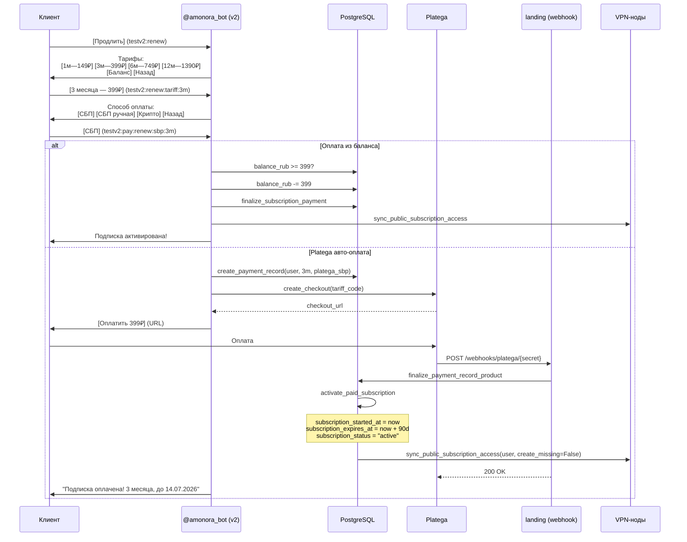
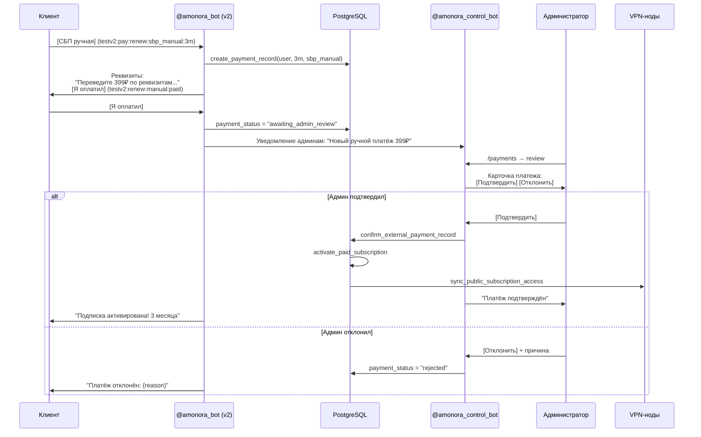

# Оплата и активация

## Обзор

Подписка Amonora не продлевается автоматически. Пользователь покупает подписку вручную через бот, выбирая тариф и способ оплаты. После подтверждения платежа — доступ активируется, VPN-маршруты обновляются.

## Sequence diagram: авто-оплата (Platega)



## Sequence diagram: ручная оплата



## Тарифы

| Код | Название | Дней | RUB | Stars | Цена/мес RUB |
|-----|----------|------|-----|-------|-------------|
| `1m` | 1 месяц | 30 | 149 ₽ | 299 ★ | 149 |
| `3m` | 3 месяца | 90 | 399 ₽ | 799 ★ | 133 |
| `6m` | 6 месяцев | 180 | 749 ₽ | 1499 ★ | 125 |
| `12m` | 12 месяцев | 365 | 1390 ₽ | 2799 ★ | 116 |

Скидки: 3м (-10%), 6м (-15%), 12м (-20%).

**ENV-переменные:** `TARIFF_1M_RUB`, `TARIFF_3M_RUB`, `TARIFF_6M_RUB`, `TARIFF_12M_RUB` (и аналогично `_STARS`).

## Способы оплаты

| Метод | Тип | Описание |
|-------|-----|----------|
| `platega_sbp` | Авто | СБП через Platega, webhook подтверждает |
| `platega_crypto` | Авто | Крипто (USDT, TON) через Platega |
| `sbp_manual` | Ручная | Реквизиты → админ подтверждает |
| `crypto_manual` | Ручная | Крипто-адрес → админ подтверждает |
| `stars` | Авто | Telegram Stars, мгновенно |
| `balance` | Авто | Внутренний баланс RUB |
| `crypto_pay` | Авто | Crypto Bot Pay (TON, USDT) |

## Активация подписки

Функция `finalize_subscription_payment(payment_record)`:

1. **Определяет продукт:** tariff_code → duration_days
2. **Активирует доступ:**
   ```python
   user.subscription_started_at = now
   user.subscription_expires_at = now + timedelta(days=duration_days)
   user.subscription_status = "active"
   ```
3. **Синхронизирует VPN:**
   - `sync_user_vpn_access` — обновляет expiry на всех VPN-нодах для VpnClient
   - `sync_public_subscription_access(user_id, create_missing=False)` — обновляет маршруты
4. **Начисляет реферальные бонусы:**
   - referrer: 50₽ (1м/3м/6м) или 100₽ (12м)
   - invited: тот же бонус на баланс
5. **Применяет промокод** (если есть pending_discount)
6. **Уведомляет пользователя** через бот

## Списание с баланса

Если `balance_rub >= сумма оплаты`:
```python
user.balance_rub -= payable_amount
user.balance_reserved_rub += reserved_amount  # временно
# → finalize immediately
user.balance_reserved_rub -= reserved_amount
finalize_subscription_payment()
```

Telegram Stars **не смешиваются** с балансом — оплачиваются отдельно.

## Промокоды при оплате

| Тип промокода | Поведение |
|---------------|-----------|
| `discount_percent` | Создаёт `pending_discount`, применяется к следующей оплате |
| `days_credit` | Немедленно активирует подписку на N дней |
| `gift_days` | Одноразовый, активирует подписку покупателю |

**Ограничения:**
- Максимум одна активная процентная скидка
- Один пользователь ≠ один промокод дважды
- Max скидка: 95%

## Уведомления об окончании подписки

Триггеры (через `control_bot`):
- `subscription_expires_3d` — за 3 дня до окончания
- `subscription_expires_today` — в день окончания
- `subscription_expired` — после окончания (доступ заблокирован)

После окончания: VPN-клиенты деактивируются (`status = "disabled"`), единая ссылка показывает "Подписка истекла".
