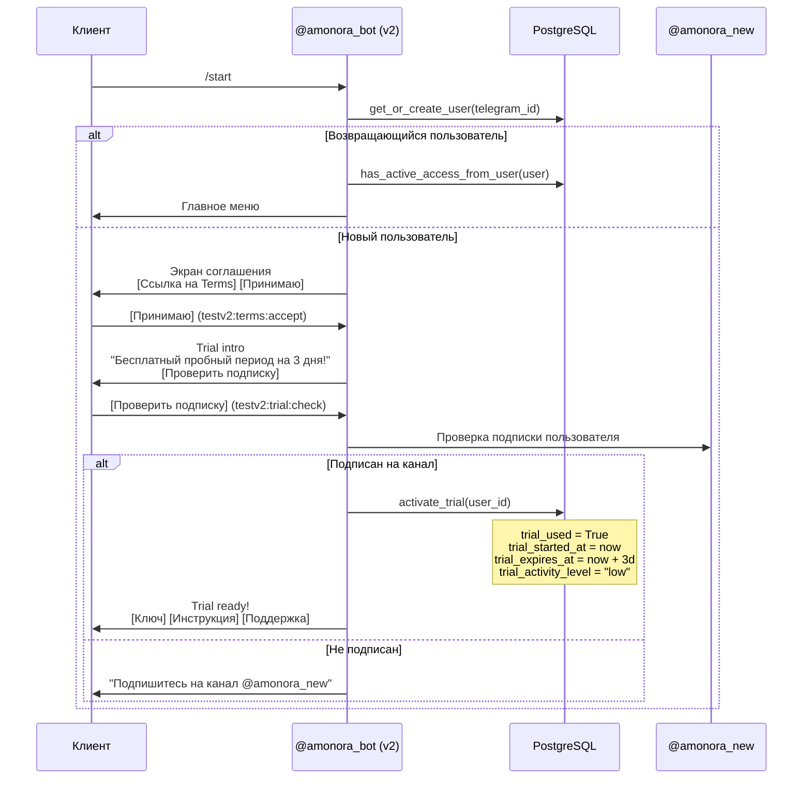

# Регистрация и триал

## Sequence diagram



## Экраны онбординга

### 1. Соглашение (`screen_key=agreement`)

**Текст:** Пользовательское соглашение (ссылка на TERMS_URL).

**Кнопки:**
```
[📜 Условия использования] (URL)
[✅ Принимаю] (testv2:terms:accept)
```

### 2. Trial intro (`screen_key=trial`)

**Текст:** "Вам доступен бесплатный пробный период на 3 дня!"

**Кнопки:**
```
[✅ Проверить подписку] (testv2:trial:check)
```

### 3. Trial ready (`screen_key=trial_ready`)

**Текст:** "Пробный период активирован! 3 дня бесплатного доступа."

**Кнопки:**
```
[🔑 Ключ] (testv2:subscription:keymenu)
[📖 Инструкция] (testv2:instruction)
[🛟 Поддержка] (testv2:support)
```

### 4. Trial уже использован (`screen_key=renew`)

**Текст:** "Пробный период уже был использован."

**Кнопки:**
```
[💳 Купить подписку] (testv2:renew)
```

## Логика активации триала

```python
# bot/db.py — activate_trial(user_id)
now = utcnow()
user.trial_used = True
user.trial_started_at = now
user.trial_expires_at = now + timedelta(days=config.trial_days)  # TRIAL_DAYS=3
user.trial_activity_level = "low"
```

**Условия активации** (`can_activate_trial_from_user`):
- `trial_used = False`
- Нет `subscription_expires_at` (нет платной подписки)
- `is_blocked = False`

**Длительность:** 3 дня (`TRIAL_DAYS=3` в ENV).

## Атрибуция при регистрации

При `/start` бот отслеживает источник привлечения:

```python
# /start ref_abc123 → command.args = "ref_abc123"
# /start source_organic → command.args = "source_organic"
```

Функция `_track_start_attribution` сохраняет `AnalyticsUserAttribution`:
- `ref_code` — реферальный код пригласившего
- `source` — органический, реклама, и т.д.

## Проверка подписки на канал

```python
# bot/db.py — is_user_subscribed(telegram_id)
bot.get_chat_member(channel_id, telegram_id)
# status: "member" / "administrator" / "creator" → подписан
# status: "left" / "kicked" → не подписан
```

Если пользователь не подписан — бот просит подписаться на `@amonora_new` и повторить.

## Возвращающийся пользователь

Функция `_show_returning_user_screen` проверяет:

```python
if has_active_access_from_user(user) or not getattr(user, "trial_used", False):
    await _send_main_menu(message, telegram_id)
    return True  # главное меню, без онбординга
```

- Если есть активная подписка → сразу главное меню
- Если триал не использован → экран trial уже использован (покупка подписки)
- Если триал активен → главное меню

## Bridge-access (без Telegram)

Если Telegram недоступен, пользователь может получить ключ на 24 часа через сайт:

```
POST /bridge/access → создаёт synthetic User + PublicSubscriptionLink
                      → возвращает connection URI на 24 часа
```

Bridge-user помечается `is_synthetic=True` и не попадает в обычные агрегаты панели.
