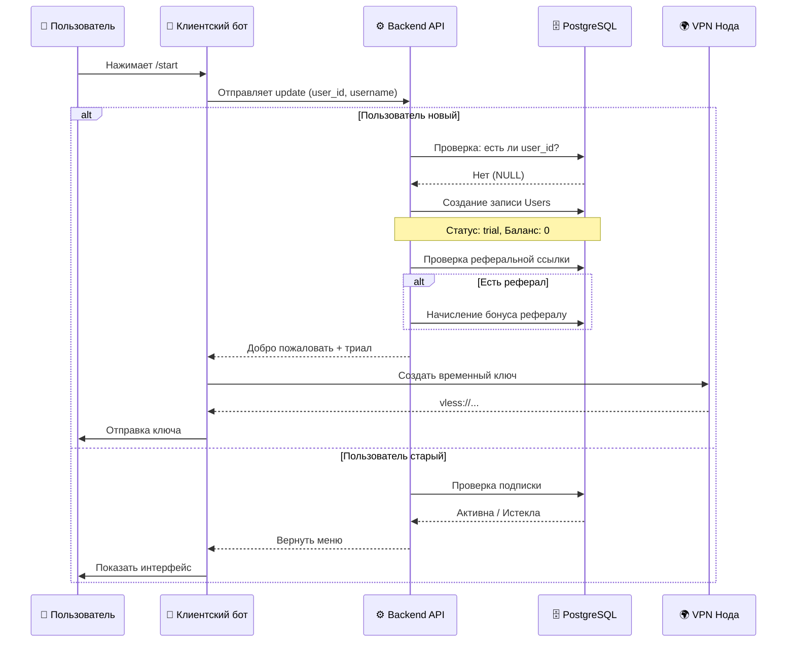
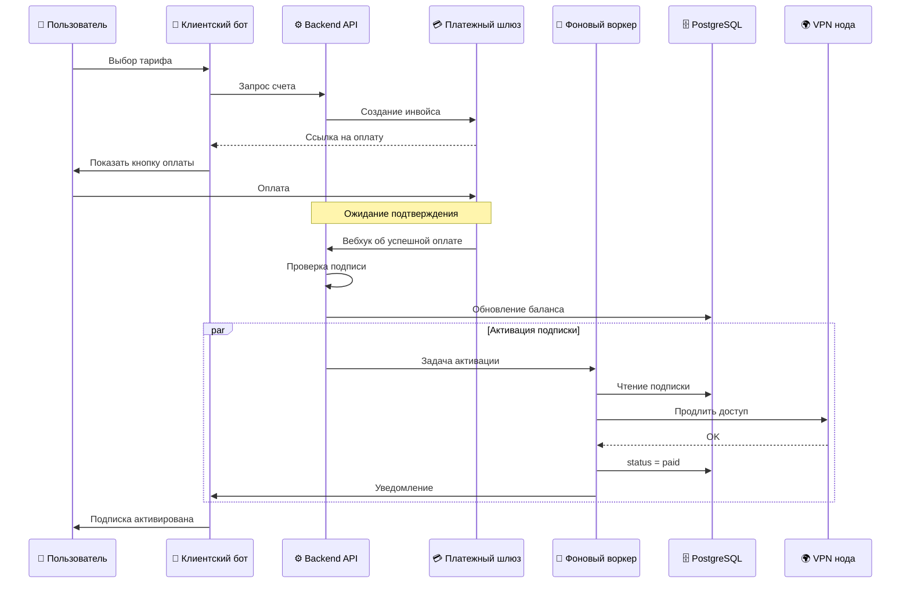

# Поток данных: Регистрация и Триал

Этот документ описывает путь нового пользователя от первого запуска бота до получения бесплатного доступа.

## 1. Схема процесса (Sequence Diagram)

## 2. Пошаговое описание

### Шаг 1: Вход в бот

Пользователь нажимает `/start` или переходит по реферальной ссылке.

- **Бот** получает сообщение от Telegram.
- **Бот** отправляет данные (`user_id`, `username`, `first_name`) на Backend API.

### Шаг 2: Идентификация

**Backend** проверяет базу данных:

- **Если пользователь есть:** Возвращает его текущий статус (активен, заблокирован, истек).
- **Если пользователя нет:**
    1. Создает новую запись в таблице `users`.
    2. Устанавливает статус `trial_active`.
    3. Записывает дату окончания триала (обычно +1 час или +24 часа от текущего времени).
    4. Если был реферальный код — начисляет бонусы обоим (рефералу и новому).

### Шаг 3: Выдача триала

Если пользователю положен триал:

1. **Backend** выбирает наименее загруженную ноду (например, Германию).
2. Делает запрос к панели ноды (3x-ui) на создание временного пользователя.
3. Получает ссылку подключения (`vless://...`).
4. Сохраняет ссылку в БД, привязывая к устройству пользователя.
5. Отправляет ответ боту.

### Шаг 4: Информирование

**Бот** показывает приветственное сообщение:

> "Привет! Вам доступен бесплатный пробный период на 24 часа. Нажмите кнопку ниже, чтобы получить ключ."

Пользователь нажимает **"Получить ключ"** → Бот присылает ссылку и инструкцию по установке приложения.

## 3. Обработка ошибок

|Ситуация|Действие системы|
|---|---|
|**Нода не отвечает**|Backend пытается выбрать другую ноду из списка. Если все упали — пишет: "Технические работы, попробуйте позже".|
|**Лимит триалов исчерпан**|Если пользователь уже брал триал с этого аккаунта (или по device fingerprint), система пишет: "Триал доступен только один раз. Оформите подписку".|
|**Ошибка в БД**|Бот пишет: "Что-то пошло не так, мы уже чиним". В лог админа уходит алерт.|

## 4. Хранение данных

В базе данных создаются следующие записи:

- Таблица `users`: `id`, `telegram_id`, `username`, `status` ('trial'), `trial_end_date`.
- Таблица `devices`: `id`, `user_id`, `node_id`, `config_link`, `status` ('active').
- Таблица `referrals`: `referrer_id`, `referee_id`, `bonus_amount`.

### 2. Оплата и активация (`docs/02-архитектура/потоки-данных/оплата-и-активация.md`)
# Поток данных: Оплата и активация

Описание процесса превращения платежа в активную подписку и продление доступа.

## 1. Схема процесса (Sequence Diagram)

