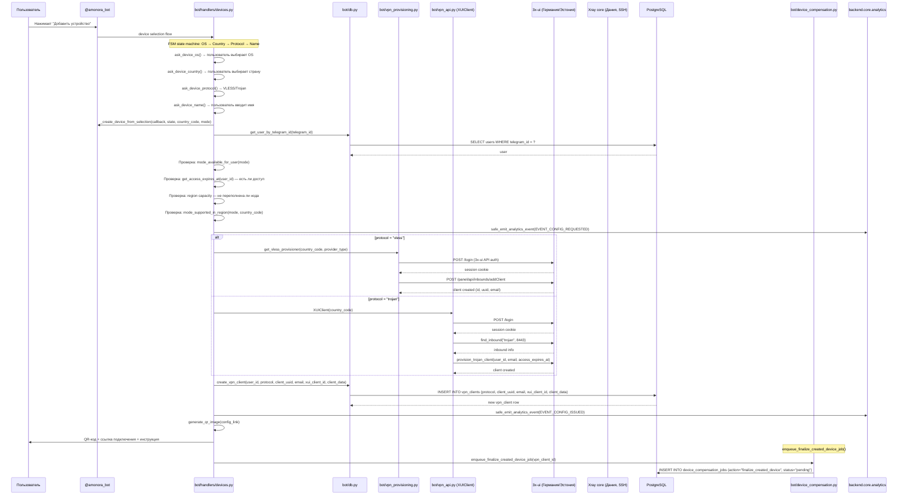
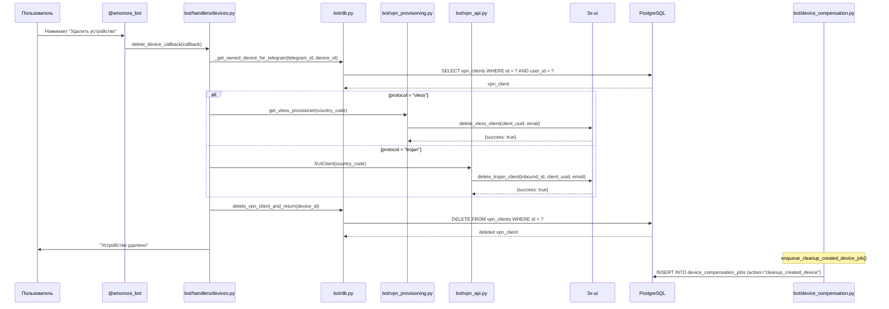
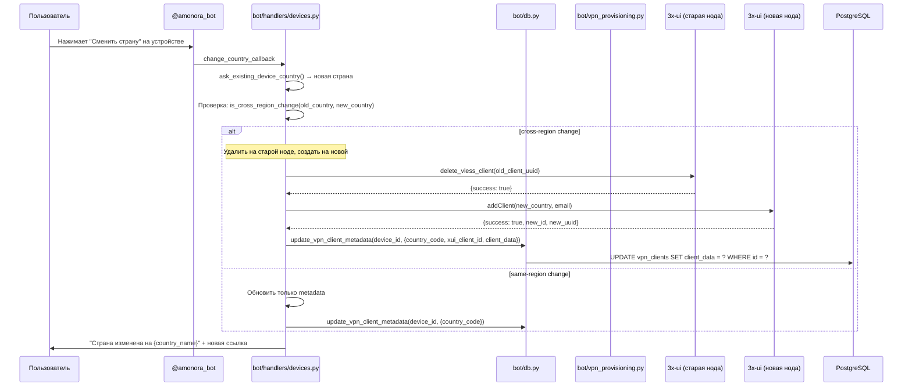
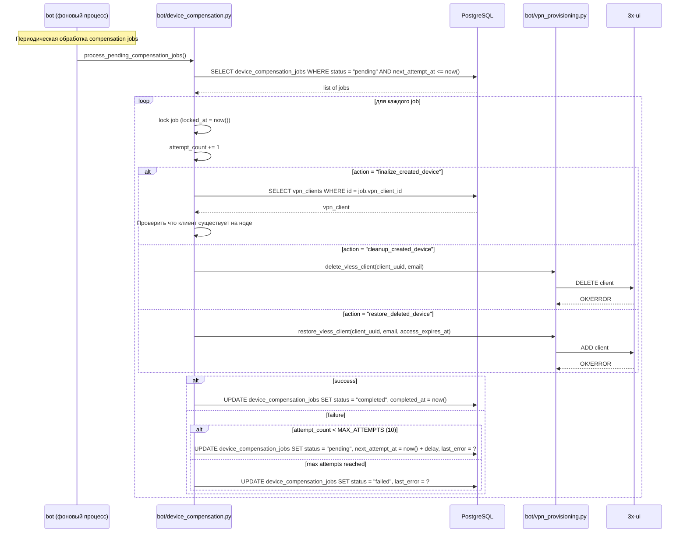

# Поток данных: Синхронизация устройств

Как устройства синхронизируются между backend, VPN-нодами и пользователем.

## 1. Sequence diagram: создание устройства

## 2. Sequence diagram: удаление устройства

## 3. Sequence diagram: смена страны устройства

## 4. Sequence diagram: device compensation (асинхронные задачи)

## 5. Лимиты устройств

| Параметр | Значение | Конфиг |
|----------|----------|--------|
| Устройства по умолчанию | 1 | `VPN_MAX_DEVICES_PER_KEY` |
| Максимальный лимит | 5 + базовый | `DEVICE_SLOT_MAX_EXTRA_SLOTS` |
| Цена дополнительного слота | 49 руб/мес | `DEVICE_SLOT_UNIT_PRICE_RUB` |
| Анти-шаринг lease | 180 сек | `VPN_ANTISHARING_LEASE_SECONDS` |
| Anti-sharing soft limit | Включён | `VPN_ANTISHARING_SOFT_LIMIT_ENABLED` |

### Как работает лимит

1. При создании устройства: `count_user_vpn_clients(user_id)` → проверка лимита
2. `get_device_limit_for_user(user_id)` = базовый лимит + активные `device_slot_entitlements`
3. Если лимит достигнут — предлагается купить дополнительные слоты
4. Каждый купленный слот: `device_slot_entitlements` запись с `expires_at`

## 6. Регионы и ноды

| Страна | Код | Хост | Runtime | Протоколы |
|--------|-----|------|---------|-----------|
| Германия | `de` | ffconnect.amonoraconnect.com | 3x-ui | VLESS, Trojan |
| Дания | `dk` | dk.amonoraconnect.com | Xray core (standalone) | VLESS (modern anti-DPI) |
| Эстония | `ee` | est.amonoraconnect.com | x-ui / Xray | VLESS (резерв) |

### Управление нодами

- **Германия/Эстония:** HTTP API к 3x-ui (`XUIClient`)
- **Дания:** SSH подключение → редактирование config.json + meta → перезапуск Xray
  - Конфиг: `XRAY_CORE_DK_CONFIG_PATH` = `/usr/local/etc/xray/config.json`
  - Мета: `XRAY_CORE_DK_META_PATH` = `/usr/local/etc/xray/amonora_dk_meta.json`
  - IP enforcement: `ops/xray_single_ip_enforcer.py`

## 7. Режимы подключения

| Режим | Описание | Протокол |
|-------|----------|----------|
| `stable` | Стандартный режим | VLESS |
| `anti-dpi` | Обход DPI (Дания) | VLESS (Xray core) |
| `mobile` | Для мобильных приложений | VLESS/Trojan |

**Файлы:** `bot/utils/modes.py`
- `resolve_effective_mode(mode, country_code)` — финальный режим
- `mode_available_for_user(mode, telegram_id)` — проверка доступа
- `mode_supported_in_region(mode, country_code)` — поддержка в регионе

## 8. Используемые таблицы БД

| Таблица | Операция |
|---------|----------|
| `vpn_clients` | INSERT при создании, DELETE при удалении, UPDATE metadata |
| `vpn_client_activations` | INSERT при активации на устройстве (fingerprint) |
| `device_slot_entitlements` | SELECT при проверке лимита |
| `device_compensation_jobs` | INSERT/UPDATE при асинхронной компенсации |
| `users` | SELECT для проверки access_expires_at, subscription_status |
| `analytics_events` | INSERT: `config_requested`, `config_issued`, `config_issue_failed`, `connection_ready`, `connection_failed` |

## 9. Ограничения

| Ограничение | Описание |
|-------------|----------|
| **Лимит устройств** | По умолчанию 1 устройство на пользователя, расширяется покупкой слотов |
| **Anti-sharing** | Lease-based detection (180 сек) — если один конфиг используется на разных IP, возможна блокировка |
| **Емкость нод** | При переполнении ноды — отказ в создании устройства |
| **Режимы по регионам** | Не все режимы доступны во всех регионах (mobile mode — ограниченный rollout) |
| **Cross-region change** | Смена страны = удаление на старой ноде + создание на новой (не мгновенно) |
| **Fingerprint** | `vpn_client_activations` отслеживает fingerprint_hash для дедупликации устройств |
| **Access expiry** | VPN-клиент создаётся с `access_expires_at` — нода может отключить по истечении |
