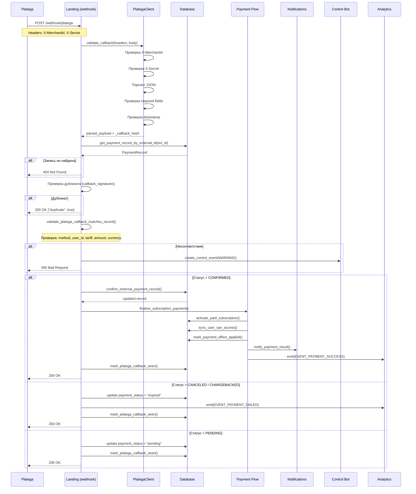

# Вебхуки Platega

## Общая информация

Platega — платёжный провайдер, поддерживающий SBP (Система быстрых платежей) и криптовалютные платежи.

- **Клиент:** `bot/platega.py` — `PlategaClient`
- **Flow обработки:** `bot/platega_flow.py` — `handle_platega_callback_payload`
- **Интеграция:** `landing/main.py` — эндпоинт вебхука на landing

---

## URL вебхука

Вебхук Platega обрабатывается на **landing** сервисе:

```
POST /webhook/platega
```

Адрес определяется конфигурацией nginx/reverse proxy. В production:
```
https://www.amonoraconnect.com/webhook/platega
```

---

## Проверка подписи (код)

Подпись проверяется в `bot/platega.py`, метод `validate_callback()`:

```python
def validate_callback(self, *, headers: dict[str, str], body: bytes) -> dict[str, Any]:
    if not self.configured:
        raise PlategaError("Platega merchant credentials are not configured")

    normalized_headers = {key.lower(): value for key, value in headers.items()}
    merchant_id = normalized_headers.get("x-merchantid") or normalized_headers.get("x-merchant-id")
    secret = normalized_headers.get("x-secret")

    if merchant_id != self.merchant_id:
        raise PlategaError("Invalid or missing X-MerchantId header")
    if secret != self.secret_key:
        raise PlategaError("Invalid or missing X-Secret header")
    if not body:
        raise PlategaError("Empty callback body")

    try:
        payload = json.loads(body.decode("utf-8"))
    except (UnicodeDecodeError, json.JSONDecodeError) as exc:
        raise PlategaError("Invalid callback JSON") from exc

    required_fields = {"id", "status", "paymentMethod"}
    missing = [field for field in required_fields if field not in payload]
    if missing:
        raise PlategaError(f"Missing callback fields: {', '.join(missing)}")

    # Проверка timestamp (защита от replay-атак)
    callback_timestamp = self._extract_callback_timestamp(payload)
    if callback_timestamp is not None:
        now_utc = datetime.now(timezone.utc)
        age_seconds = (now_utc - callback_timestamp).total_seconds()
        if age_seconds > self.webhook_max_age_seconds:
            raise PlategaError("Callback payload is too old")
        if age_seconds < -300:
            raise PlategaError("Callback payload timestamp is in the future")

    # Сохраняем хэш тела для deduplication
    payload["_callback_hash"] = hashlib.sha256(body).hexdigest()
    return payload
```

**Ключевые проверки:**
1. `X-MerchantId` header совпадает с `config.platega_merchant_id`
2. `X-Secret` header совпадает с `config.platega_secret_key`
3. Тело — валидный JSON
4. Поля `id`, `status`, `paymentMethod` присутствуют
5. Timestamp не старше `PLATEGA_CALLBACK_MAX_AGE_SECONDS` (по умолчанию 1800 сек = 30 мин)
6. Timestamp не в будущем (допуск -300 сек)

---

## Формат запроса

### Входящий вебхук (от Platega)

**Headers:**
```
X-MerchantId: 12345
X-Secret: sk_live_...
Content-Type: application/json
```

**Body (JSON):**
```json
{
  "id": "txn_abc123",
  "status": "CONFIRMED",
  "paymentMethod": 2,
  "amount": 399.0,
  "currency": "RUB",
  "payload": "{\"type\":\"subscription\",\"user_id\":42,\"telegram_id\":123456789,\"tariff_code\":\"3m\",\"payment_method\":\"sbp_platega\"}",
  "timestamp": "2026-04-14T10:30:00Z"
}
```

### Поля payload

Поле `payload` — JSON-строка, содержащая данные, переданные при создании платежа:

| Поле | Тип | Описание |
|------|-----|----------|
| `type` | string | Тип: `subscription`, `balance_topup`, `device_slot`, `gift_subscription` |
| `user_id` | int | Внутренний ID пользователя |
| `telegram_id` | int\|null | Telegram ID пользователя |
| `tariff_code` | string | Код тарифа (`1m`, `3m`, `6m`, `12m`) |
| `payment_method` | string | Метод: `sbp_platega`, `crypto_platega` |
| `list_price_amount` | int | Полная цена (до применения баланса) |
| `payable_amount` | int | Сумма к оплате |
| `balance_amount` | int | Сумма с баланса |

---

## Обработка (пошагово)

Обработка происходит в `bot/platega_flow.py`, функция `handle_platega_callback_payload()`:

### Шаг 1: Валидация callback

```python
client = PlategaClient()
parsed_payload = client.validate_callback(headers=request.headers, body=request.body)
```

### Шаг 2: Поиск записи платежа

```python
transaction_id = str(parsed_payload.get("id") or "").strip()
record = await get_payment_record_by_external_id(transaction_id)
if record is None:
    # Запись не найдена — ошибка
    return JSONResponse({"error": "Payment record not found"}, status_code=404)
```

### Шаг 3: Проверка дубликата

```python
if _platega_callback_is_duplicate_noop(record, parsed_payload, parsed_payload):
    # Уже обработано — возвращаем OK
    return JSONResponse({"ok": True, "duplicate": True})
```

Система отслеживает хэши callback-сигнатур в `metadata_json` записи платежа:
- `PAYMENT_PROVIDER_CALLBACK_SIGNATURES_KEY` — история подписей (до 12 записей)
- `PAYMENT_PROVIDER_CALLBACK_EVENT_KEYS_KEY` — история event keys (до 12 записей)
- `PAYMENT_PROVIDER_CALLBACK_REPEAT_COUNT_KEY` — счётчик повторных отправок

### Шаг 4: Валидация соответствия записи

```python
await _validate_platega_callback_matches_record(
    record,
    payload=parsed_payload,
    parsed_payload=parsed_payload,
    payment_method=record.payment_method,
    payload_type=payload["type"],
    tariff_code=record.tariff_code,
)
```

Проверяются:
- `payment_method` совпадает
- `user_id` совпадает (если оба присутствуют)
- `tariff_code` совпадает
- `amount` совпадает
- `currency` совпадает

При несоответствии — создаётся событие в control_bot с `severity=WARNING`.

### Шаг 5: Обработка по статусу

#### Статус CONFIRMED

```python
if provider_status == PlategaClient.STATUS_CONFIRMED:
    # Подтверждаем платёж
    record = await confirm_external_payment_record(
        session,
        int(record.id),
        external_payment_id=transaction_id,
        provider_name=PLATEGA_PROVIDER_NAMES.get(record.payment_method),
    )
```

После подтверждения:
1. `finalize_subscription_payment()` — активирует подписку
2. `notify_payment_result()` — уведомляет пользователя
3. `process_referral_reward()` — обрабатывает реферальное вознаграждение
4. `sync_income_entry_for_payment_record()` — синхронизирует финансовую запись
5. Создаётся аналитическое событие `EVENT_PAYMENT_SUCCESS`

#### Статус PENDING

```python
if provider_status == PlategaClient.STATUS_PENDING:
    record.payment_status = "pending"
    # Обновляем metadata с provider_status
```

#### Статус CANCELED / CHARGEBACKED

```python
if provider_status in {PlategaClient.STATUS_CANCELED, PlategaClient.STATUS_CHARGEBACKED}:
    record.payment_status = "expired"
    record.expires_at = record.expires_at or utcnow()
    # Emit analytics event: EVENT_PAYMENT_FAILED
```

### Шаг 6: Синхронизация (если запись уже подтверждена)

Если платёж уже подтверждён локально, но провайдер вернул другой статус:

```python
if record.payment_status == "confirmed" and provider_status != PlategaClient.STATUS_CONFIRMED:
    provider_sync_problem = _provider_problem_text(...)
    # Создаём event в control_bot
    await _emit_provider_mismatch_event(record, provider_status, parsed_payload)
```

### Шаг 7: Обновление metadata

```python
await _mark_platega_callback_seen(record, payload=parsed_payload, parsed_payload=parsed_payload)
```

Сохраняет хэш и event key в metadata для deduplication.

---

## Создание платежа (обратный flow)

Когда пользователь выбирает оплату через Platega:

```python
record = await ensure_platega_payment_record(
    user_id=user_id,
    telegram_id=telegram_id,
    tariff_code=tariff_code,
    payment_method="sbp_platega",  # или "crypto_platega"
    list_price_amount=tariff.rub_price,
    payable_amount=payable_amount,
    duration_days=tariff.duration_days,
    tariff_title=tariff.title,
)
```

Platega возвращает:
- `transaction_id` — ID транзакции
- `checkout_url` — URL для оплаты (перенаправление пользователя)
- `status` — начальный статус (обычно `PENDING`)

---

## Методы платежей Platega

```python
class PlategaClient:
    METHOD_SBP_QR = 2       # SBP (QR-код)
    METHOD_CRYPTO = 13      # Криптовалюта
```

Mapping в `bot/platega_flow.py`:

```python
PLATEGA_METHOD_IDS = {
    "sbp_platega": PlategaClient.METHOD_SBP_QR,
    "crypto_platega": PlategaClient.METHOD_CRYPTO,
}
PLATEGA_PAYMENT_SOURCES = {
    "sbp_platega": "platega_sbp",
    "crypto_platega": "platega_crypto",
}
PLATEGA_PROVIDER_NAMES = {
    "sbp_platega": "Platega SBP",
    "crypto_platega": "Platega Crypto",
}
```

---

## Статусы Platega

```python
class PlategaClient:
    STATUS_PENDING = "PENDING"       # Ожидает оплаты
    STATUS_CONFIRMED = "CONFIRMED"   # Подтверждён
    STATUS_CANCELED = "CANCELED"      # Отменён
    STATUS_CHARGEBACKED = "CHARGEBACKED"  # Chargeback
```

---

## Коды ошибок

| Ошибка | Описание | Действие |
|--------|----------|----------|
| `Platega merchant credentials are not configured` | Отсутствуют `PLATEGA_MERCHANT_ID` или `PLATEGA_SECRET_KEY` | Проверь .env |
| `Invalid or missing X-MerchantId header` | Неверный header от Platega | Проверь настройки webhook в Platega |
| `Invalid or missing X-Secret header` | Неверный секрет | Сверь секреты |
| `Empty callback body` | Пустое тело запроса | Platega отправляет пустой webhook |
| `Invalid callback JSON` | Невалидный JSON | Проблема на стороне Platega |
| `Missing callback fields: ...` | Отсутствуют обязательные поля | Проверь версию API Platega |
| `Callback payload is too old` | Timestamp старше 1800 сек | Часы сервера расходятся |
| `Callback payload timestamp is in the future` | Timestamp в будущем | Часы сервера расходятся |
| `Callback payload mismatch for existing payment record` | Данные не совпадают с записью | Investigate в control_bot events |
| `Payment record not found` | Нет записи с таким external_payment_id | Платёж не был создан в системе |
| `Payment record is not managed by Platega` | Запись принадлежит другому провайдеру | Проверь payment_method |
| `Provider transaction ID is missing` | Нет external_payment_id | Баг в создании записи |

---

## Sequence Diagram



---

## Sync-операции (ручная синхронизация)

Функция `sync_platega_record()` в `bot/platega_flow.py` позволяет вручную синхронизировать статус:

```python
result = await sync_platega_record_by_id(
    record_id=123,
    notify_user=True,
    bot=bot_instance,
)
```

Шаги:
1. Загружаем запись платежа
2. Запрашиваем статус у Platega API (`GET /transaction/{transaction_id}`)
3. Сравниваем с локальным статусом
4. При необходимости — подтверждаем, уведомляем, создаём события

---

## Конфигурация

Необходимые переменные окружения:

```env
PLATEGA_MERCHANT_ID=12345
PLATEGA_SECRET_KEY=sk_live_...
PLATEGA_BASE_URL=https://app.platega.io
PLATEGA_WEBHOOK_SECRET=whsec_...
PLATEGA_CALLBACK_MAX_AGE_SECONDS=1800
ENABLE_PLATEGA_SBP_USER_FLOW=1
ENABLE_PLATEGA_CRYPTO_USER_FLOW=1
```
