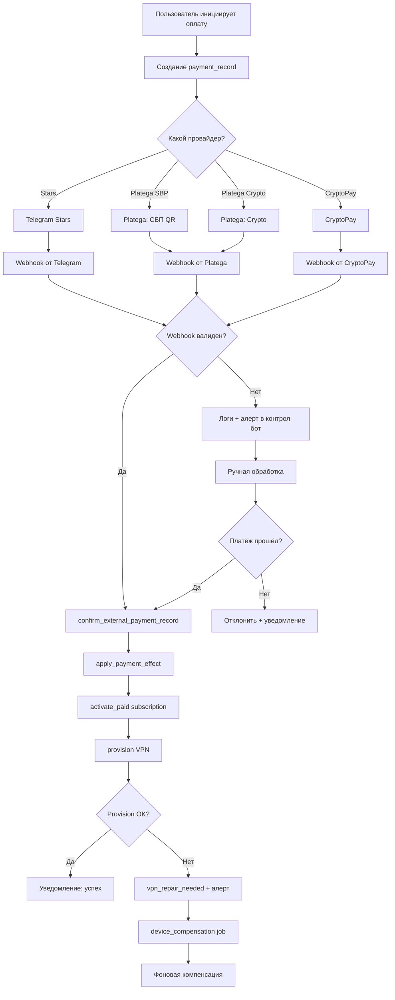

# Ручная обработка платежей

## Когда нужна ручная обработка

Ручная обработка платежа требуется в следующих случаях:

| Ситуария | Описание |
|----------|----------|
| **Вебхук не пришёл** | Platega/CryptoPay не отправили callback, или callback потерялся |
| **Ошибка валидации** | Подпись вебхука не совпадает, истёк TTL |
| **Платёж в pending > 12 часов** | `MANUAL_PAYMENT_REVIEW_HOURS=12` — порог ручного review |
| **Платёж failed** | Провал с ошибкой provisioning или sync |
| **Ошибка повторного webhook** | Дубликат с другой подписью |
| **Balance topup** | Пополнение баланса требует подтверждения |

## Где смотреть pending-платежи

### Через Dashboard

1. Открой `https://amonoraconnect.com/payments`
2. Фильтр: статус `pending` или `failed`
3. Сортировка по дате — самые старые сверху

### Через Control Bot

```
/payments → выбери фильтр → pending
```

### Через БД напрямую

```sql
-- Все pending платежи старше 12 часов
SELECT id, user_id, amount, provider, status, external_id,
       metadata_json, created_at, updated_at
FROM payment_records
WHERE status IN ('pending', 'failed')
  AND created_at < NOW() - INTERVAL '12 hours'
ORDER BY created_at ASC;

-- Проверить есть ли у пользователя уже активный доступ
SELECT u.telegram_id, u.subscription_status, u.subscription_expires_at
FROM users u
WHERE u.id IN (
    SELECT DISTINCT user_id FROM payment_records
    WHERE status IN ('pending', 'failed')
);
```

## Как подтвердить платёж

### Через Control Bot (рекомендуемый способ)

1. Открой `/payments` → найди платёж
2. Нажми на платёж → откроется детальный экран
3. Если доступен ручной review → нажми «Confirm payment»
4. Подтверди действие

### Через Dashboard

1. Открой `/payments`
2. Найди нужный платёж
3. Нажми «Confirm» (если доступна ручная обработка)

### Через БД напрямую

```sql
-- 1. Проверить текущий статус
SELECT id, status, amount, provider, metadata_json
FROM payment_records
WHERE id = <payment_id>;

-- 2. Обновить статус (только если платёж реально прошёл!)
UPDATE payment_records
SET status = 'confirmed',
    updated_at = NOW(),
    metadata_json = jsonb_set(
        COALESCE(metadata_json, '{}'::jsonb)::jsonb,
        '{manual_confirmed}',
        'true'
    )::text
WHERE id = <payment_id> AND status = 'pending';

-- 3. После этого запустить sync доступа
-- Это делается автоматически через payment_flow.py
-- Или вручную через контрол-бот → repair user access
```

## Как отклонить платёж

### Через Control Bot

1. `/payments` → найди платёж
2. Нажми «Reject payment»
3. Укажи причину отклонения

### Через Dashboard

1. `/payments` → найди платёж
2. Нажми «Reject»
3. Укажи причину

### Через БД

```sql
UPDATE payment_records
SET status = 'rejected',
    updated_at = NOW(),
    metadata_json = jsonb_set(
        COALESCE(metadata_json, '{}'::jsonb)::jsonb,
        '{manual_rejected_reason}',
        '"<причина>"'
    )::text
WHERE id = <payment_id> AND status = 'pending';
```

## Уведомление пользователя

После подтверждения/отклонения платежа пользователь получает уведомление:

**При подтверждении**:
- Доступ к VPN активируется автоматически
- Бот отправляет сообщение об успешной оплате
- Если provisioning не прошёл — ставится `vpn_repair_needed`

**При отклонении**:
- Пользователь получает сообщение об отклонении
- Предлагается обратиться в поддержку
- Платёж остаётся в истории с статусом `rejected`

## SQL для проверки в БД

```sql
-- Последние 20 платежей с деталями
SELECT
    pr.id,
    pr.user_id,
    u.telegram_id,
    u.username,
    pr.amount,
    pr.provider,
    pr.status,
    pr.external_id,
    pr.created_at,
    pr.updated_at
FROM payment_records pr
LEFT JOIN users u ON u.id = pr.user_id
ORDER BY pr.created_at DESC
LIMIT 20;

-- Платежи без webhook (нет external_id)
SELECT *
FROM payment_records
WHERE external_id IS NULL
  AND status = 'pending'
  AND created_at < NOW() - INTERVAL '1 hour';

-- Платежи с ошибками provisioning
SELECT pr.id, pr.user_id, pr.metadata_json
FROM payment_records pr
WHERE pr.metadata_json::jsonb->>'access_sync_state' = 'failed';

-- Дубликаты платежей (одни и те же user_id + amount за короткий период)
SELECT user_id, amount, COUNT(*) as cnt
FROM payment_records
WHERE status = 'confirmed'
  AND created_at > NOW() - INTERVAL '24 hours'
GROUP BY user_id, amount
HAVING COUNT(*) > 1;
```

## Flow обработки платежа



## Platega fallback-логика

В `bot/platega_flow.py` и `bot/platega.py`:

- Если Platega SBP недоступен → fallback на manual SBP (если `ENABLE_MANUAL_SBP_USER_FLOW=1`)
- Если Platega Crypto недоступен → fallback на manual crypto
- Webhook обрабатывается с проверкой подписи, TTL и дедупликацией по signature history (limit 12)

## Настройки ручных платежей

Из `.env.example`:

| Переменная | Значение по умолчанию | Описание |
|-----------|---------------------|----------|
| `ENABLE_MANUAL_SBP_USER_FLOW` | `0` | Разрешить ручной СБП |
| `ENABLE_MANUAL_CRYPTO_USER_FLOW` | `0` | Разрешить ручной crypto |
| `FORCE_MANUAL_SBP_USER_FLOW` | `0` | Принудительно ручной СБП |
| `MANUAL_PAYMENT_REVIEW_HOURS` | `12` | Порог ручного review (часы) |
