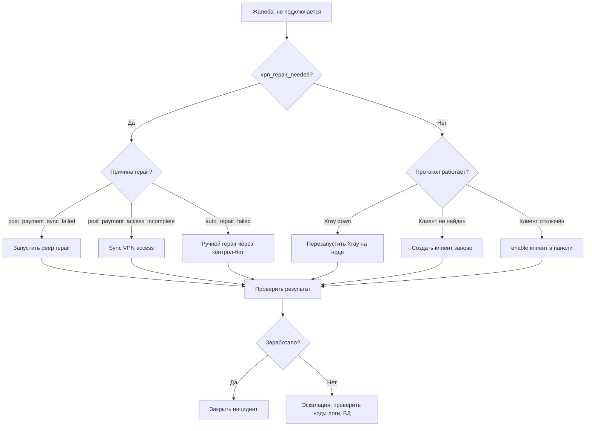

# Частые проблемы и troubleshooting

## Как пользоваться этой инструкцией

Найди симптом в таблице ниже → перейди к разделу диагностики → выполни шаги решения.

## Таблица проблем

| Проблема | Вероятная причина | Диагностика | Решение |
|----------|------------------|-------------|---------|
| Пользователь не может подключиться | vpn_repair_needed, сбой provisioning, устройство не синхронизировано | Проверить `vpn_repair_needed` в БД, логи provisioning | Запустить repair через контрол-бот или вручную |
| Нода не отвечает | Xray/3x-ui упал, SSH недоступен, сервер перегружен | Проверить systemd-статус, логи, ping | Перезапустить сервис, SSH-ремонт, эскалация |
| Диск заполнен | Бэкапы, логи Xray, состояние enforcer | `df -h`, проверить `/var/log/xray/`, `/opt/amonora_bot/backups/` | Очистить старые бэкапы, ротация логов |
| Автоплатёж не проходит | Вебхук Platega не дошёл, ошибка валидации, неверная подпись | Логи бота, таблица payment_records | Ручная обработка платежа |
| Бот не отвечает | Процесс упал, БД недоступна, токен отозван | `systemctl status`, логи | Перезапуск, проверка БД |
| Dashboard UI не загружается | Next.js процесс упал | `systemctl status amonora-dashboard-ui` | Перезапуск |

---

## Проблема: Пользователь не может подключиться

### Симптомы

- Пользователь пишет в поддержку: «VPN не работает»
- В контрол-боте алерт: «Пользователи требуют срочной проверки»
- `vpn_repair_needed = true` в БД

### Диагностика

```bash
# 1. Найти пользователя по telegram_id
psql -U amonora -d amonora_db -c "
  SELECT id, telegram_id, username, subscription_status,
         vpn_repair_needed, vpn_repair_reason, vpn_repair_marked_at
  FROM users
  WHERE telegram_id = <telegram_id>;
"

# 2. Проверить его VPN-клиенты
psql -U amonora -d amonora_db -c "
  SELECT id, protocol, email, client_uuid, metadata_json
  FROM vpn_clients
  WHERE user_id = (SELECT id FROM users WHERE telegram_id = <telegram_id>);
"

# 3. Проверить причину repair
# vpn_repair_reason может быть:
# - "post_payment_sync_failed" — после оплаты доступ не выдан
# - "post_payment_access_incomplete" — доступ частично выдан
# - "auto_repair_failed" — авто-ремонт не помог
```

### Решение

**Вариант 1 — через контрол-бот**:
1. `/user` → ввести telegram_id
2. Нажать «Repair access» → «Deep repair»
3. Дождаться результата

**Вариант 2 — вручную через БД**:
```bash
# Сбросить флаг repair_needed (временное решение)
psql -U amonora -d amonora_db -c "
  UPDATE users
  SET vpn_repair_needed = false
  WHERE telegram_id = <telegram_id>;
"
```

**Вариант 3 — полная синхронизация**:
```python
# Выполнить sync_user_vpn_access из payment_flow.py
# Это проверит и восстановит все VPN-клиенты пользователя
```

### Mermaid-диагностика



---

## Проблема: Нода не отвечает

### Диагностика

```bash
# 1. Проверить статус ноды (подключиться по SSH или проверить control_bot алерты)
# 2. Проверить статус сервисов на ноде
ssh root@<node-ip>

# Для Дании (Xray Core)
ssh root@81.17.159.58
systemctl status xray
journalctl -u xray -n 100 --no-pager

# Проверить 3x-ui через туннель
# Туннель: 127.0.0.1:12053 → 213.108.20.34:2053
curl -s http://127.0.0.1:12053/panel/api/inbounds/list

# 3. Проверить ping
ping -c 5 <node-ip>

# 4. Проверить загрузку
ssh root@<node-ip> "uptime && free -h && df -h"
```

### Решение

| Состояние | Действие |
|-----------|----------|
| Xray упал | `systemctl restart xray` |
| 3x-ui упал | `systemctl restart 3x-ui` |
| Сервер не отвечает по SSH | Эскалация → проверить у хостера, reboot |
| Сервер перегружен | Проверить top процессы, при необходимости — kill |
| Диск заполнен | См. раздел ниже |

---

## Проблема: Диск заполнен

### Диагностика

```bash
# Проверить общее использование
df -h

# Найти большие директории
du -sh /opt/amonora_bot/backups/* 2>/dev/null | sort -hr | head -10
du -sh /var/log/xray/ 2>/dev/null
du -sh /var/log/ 2>/dev/null | sort -hr | head -10

# Проверить состояние enforcer (Дания)
ls -la /usr/local/etc/xray/amonora_dk_single_ip_state.json
cat /usr/local/etc/xray/amonora_dk_single_ip_state.json | python3 -m json.tool | wc -l
```

### Решение

```bash
# 1. Очистить старые бэкапы (retention = 7 дней, автоматический)
# Если нужно вручную:
find /opt/amonora_bot/backups/core-pg/ -mindepth 1 -maxdepth 1 -type d -mtime +3 -exec rm -rf {} +

# 2. Ротация логов Xray
find /var/log/xray/ -name "*.log" -mtime +7 -delete

# 3. Очистить старые state-файлы
find /opt/amonora_bot/ops/*/state/ -name "*.json" -mtime +30 -delete
```

---

## Проблема: Автоплатёж не проходит

### Диагностика

```bash
# 1. Проверить payment_records
psql -U amonora -d amonora_db -c "
  SELECT id, user_id, amount, status, provider,
         external_id, metadata_json, created_at
  FROM payment_records
  WHERE status IN ('pending', 'failed')
  ORDER BY created_at DESC
  LIMIT 20;
"

# 2. Проверить логи бота на предмет Platega webhook
journalctl -u amonora-control-bot -n 500 --no-pager | grep -i platega

# 3. Проверить статус в Platega API
# (нужны merchant_id и secret_key)
```

### Решение

1. **Вебхук не пришёл**: проверить в Platega dashboard статус платежа
2. **Вебхук пришёл, но ошибка**: проверить логи, исправить проблему, повторить sync
3. **Ручная обработка**: см. `/docs/04-эксплуатация/инциденты/ручная-обработка-платежей.md`

---

## Проблема: Бот не отвечает

### Диагностика

```bash
# 1. Проверить статус сервисов
systemctl status amonora-control-bot
systemctl status amonora-test-bot

# 2. Проверить логи
journalctl -u amonora-control-bot -n 100 --no-pager --since "1 hour ago"

# 3. Проверить БД
systemctl is-active postgresql
psql -U amonora -d amonora_db -c "SELECT 1"

# 4. Проверить токен
cat /opt/amonora_bot/.env | grep BOT_TOKEN
```

### Решение

```bash
# Перезапуск бота
systemctl restart amonora-control-bot

# Если проблема в БД
systemctl restart postgresql

# Если проблема с токеном (отозван BotFather)
# См. docs/04-эксплуатация/обслуживание/ротация-токенов.md
```

---

## Проблема: Dashboard UI не загружается

### Диагностика

```bash
systemctl status amonora-dashboard-ui
journalctl -u amonora-dashboard-ui -n 100 --no-pager
curl -sI http://127.0.0.1:3001/
```

### Решение

```bash
systemctl restart amonora-dashboard-ui

# Если проблема в Next.js сборке
cd /opt/amonora_bot/dashboard/ui
npm run build
systemctl restart amonora-dashboard-ui
```
