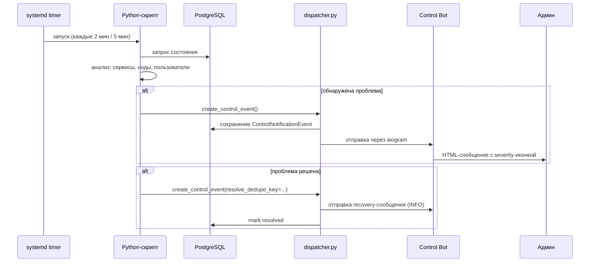
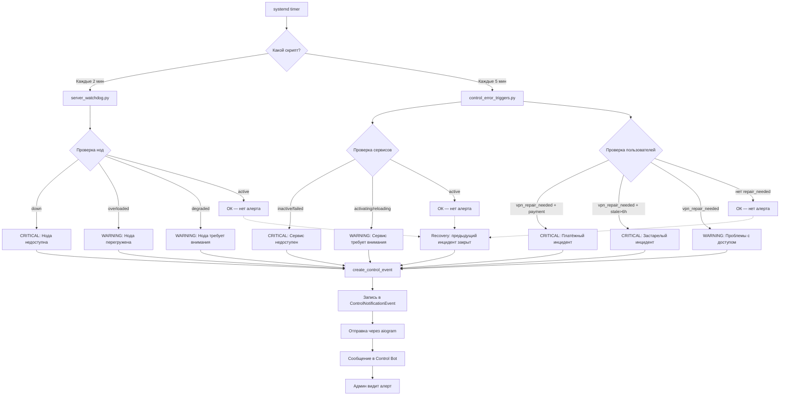

# Алерты в контрол-боте

## Обзор

Контрол-бот (`@amonora_control_bot`) — основной канал получения операционных алертов для команды. Алерты генерируются двумя механизмами:

1. **`control_error_triggers`** (`ops/control_error_triggers.py`) — проверка состояния сервисов, нод и пользователей
2. **`server_watchdog`** (`ops/server_watchdog.py`) — мониторинг здоровья VPN-серверов

## Как алерт попадает в контрол-бот

## Типы алертов

| Тип | Категория | Триггер | Severity | Действие |
|-----|-----------|---------|----------|----------|
| **Сервис недоступен** | `errors` | `systemctl is-active` вернул `inactive`/`failed`/`dead` | CRITICAL | Проверить лог сервиса, перезапустить |
| **Сервис требует внимания** | `errors` | `systemctl is-active` вернул `activating`/`reloading`/`unknown` | WARNING | Подождать, если долго — проверить лог |
| **Нода недоступна** | `nodes` | Health-check ноды вернул `down` | CRITICAL | SSH к ноде, проверить Xray/3x-ui, запустить ремонт |
| **Нода деградирует** | `nodes` | Health-check вернул `degraded`, runtime warning | WARNING | Наблюдать, при усугублении — ремонт |
| **Нода перегружена** | `nodes` | CPU/RAM/disk превысили лимит региона | WARNING | Проверить нагрузку, рассмотреть масштабирование |
| **Пользователи требуют проверки** | `access` | `vpn_repair_needed=True` у пользователей | WARNING/CRITICAL | Открыть пользователя в контрол-боте, запустить repair |
| **Сервис восстановился** | `errors` | Сервис вернулся в `active` | INFO | Убедиться, что всё работает |
| **Нода восстановилась** | `nodes` | Health-check снова зелёный | INFO | Проверить, что подключения работают |
| **Access восстановлен** | `access` | Нет пользователей с `vpn_repair_needed` | INFO | — |
| **Daily Summary** | `system` | Ежедневная сводка (настраиваемый час) | INFO | Ознакомиться с количеством нерешённых событий |

## Monitored service units

`control_error_triggers.py` отслеживает следующие systemd-юниты:

| Ключ | Unit | Название |
|------|------|----------|
| `main_bot` | `amonora-bot.service` | Main bot |
| `support_bot` | `amonora-support-bot.service` | Support bot |
| `control_bot` | `amonora-control-bot.service` | Control bot |
| `dashboard` | `amonora-dashboard.service` | Dashboard backend |
| `dashboard_ui` | `amonora-dashboard-ui.service` | Dashboard UI |
| `landing` | `amonora-landing.service` | Landing |
| `nginx` | `nginx.service` | Nginx |
| `access_reminders_timer` | `amonora-access-reminders.timer` | Access reminders timer |
| `server_watchdog_timer` | `amonora-server-watchdog.timer` | Server watchdog timer |

## Priority levels

| Severity | Иконка | Значение | Реакция |
|----------|--------|----------|---------|
| **CRITICAL** | 🚨 | Сервис/нода недоступны, платёжные инциденты | Немедленная реакция. Если платёжный repair > 0 — критично |
| **WARNING** | ⚠️ | Сервис в нестабильном состоянии, нода деградирует, non-payment repair | Реакция в течение часа |
| **INFO** | ♦️ | Восстановление, сводки, новые пользователи | Ознакомиться, действий не требуется |

### Эскалация пользовательских инцидентов

Пользовательские алерты получают CRITICAL если:
- Есть хотя бы один **платёжный** инцидент (`is_payment_related_repair_reason`)
- Есть **застарелый** инцидент (> 6 часов с момента обнаружения)

Иначе — WARNING.

## Что делать при каждом типе

### Сервис недоступен (CRITICAL)

1. Открой контрол-бот → `/alerts`
2. Посмотри детали: какой сервис, какой статус
3. Проверь логи: `journalctl -u <unit> -n 100 --no-pager`
4. Попробуй перезапустить: `systemctl restart <unit>`
5. Если не помогло — проверь зависимости (БД, сеть, диски)

### Нода недоступна (CRITICAL)

1. Открой контрол-бот → `/nodes`
2. Посмотри статус ноды, ping, runtime
3. Попробуй SSH: `ssh root@<node-ip>`
4. Проверь Xray: `systemctl status xray`
5. Если нужно — запусти ремонт через `/problems` → выбрать ноду → repair

### Пользователи требуют проверки

1. Открой контрол-бот → `/alerts`
2. Посмотри список пользователей с причинами
3. Открой конкретного пользователя: `/user` → ввести telegram_id
4. Запусти repair: кнопка "Repair access"
5. Если причина платёжная — проверь статус платежа `/payments`

## Flow алерта (полная диаграмма)

## Команды контрол-бота для работы с алертами

| Команда | Описание |
|---------|----------|
| `/alerts` | Экран алертов и предупреждений |
| `/status` | Общий статус системы |
| `/nodes` | Список нод и их состояние |
| `/problems` | Проблемы и инциденты |
| `/events` | Последние события |
| `/notifications` | Управление уведомлениями |
| `/settings` | Настройки уведомлений |
| `/dashboard` | Операционный дашборд |

## Дедупликация

Алерты дедуплицируются по `dedupe_key`:
- Сервисы: `control-health:service:<service_key>`
- Ноды: `control-health:node:<server_id>`
- Пользователи: `control-health:users:repair-needed`

Recovery-сообщения отправляются только если инцидент был ранее открыт и ещё не закрыт.
