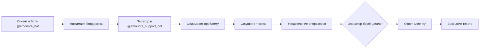

# Поддержка

## Обзор

Система поддержки Amonora работает через отдельного Telegram-бота `@amonora_support_bot`. Клиенты обращаются с вопросами, операторы отвечают через панель в боте и дашборде.

**Источник:** `support_bot/main.py`, `bot/handlers/support.py`

## Путь обращения



### Шаг 1: Клиент переходит в поддержку

В основном боте `@amonora_bot` кнопка «Поддержка» открывает ссылку на `@amonora_support_bot`.

**Источник:** `bot/handlers/support.py` — `SUPPORT_URL = "https://t.me/amonora_support_bot"`

### Шаг 2: Создание тикета

При первом сообщении в support_bot:
- Создаётся запись `SupportTicket`
- `user_id` — Telegram ID клиента
- `status` — `new`
- Сохраняется превью сообщения

Тикет создаётся автоматически при первом сообщении. Отдельной команды для создания нет.

**Источник:** `support_bot/storage.py` — `register_user_message()`

### Шаг 3: Уведомление операторов

Новый тикет отображается у всех операторов support (список `SUPPORT_ADMIN_IDS`):
- В панели поддержки (`/tickets`)
- Уведомление в личку от бота

### Шаг 4: Оператор берёт диалог

Оператор нажимает «Взять диалог» → тикет получает `assigned_admin_id` → статус меняется на `in_progress`.

### Шаг 5: Ответ клиенту

Оператор отвечает прямо в боте → сообщение пересылается клиенту с пометкой «Ответ поддержки Amonora».

### Шаг 6: Закрытие тикета

Оператор нажимает «Закрыть» → статус `closed` → клиент получает уведомление.

**Источник:** `support_bot/router.py`

## Тикет: модель данных

Таблица `support_tickets`:

| Поле | Описание |
|------|----------|
| `id` | Уникальный ID |
| `user_id` | Telegram ID клиента (unique) |
| `username` | Username клиента |
| `full_name` | Полное имя |
| `status` | `new`, `in_progress`, `closed` |
| `assigned_admin_id` | ID ответственного оператора |
| `assigned_admin_name` | Имя оператора |
| `last_message_preview` | Превью последнего сообщения |
| `last_user_message_preview` | Превью последнего сообщения клиента |
| `last_admin_reply_preview` | Превью последнего ответа оператора |
| `admin_cards_json` | JSON с ID карточек у операторов |
| `created_at` | Время создания |
| `updated_at` | Время обновления |
| `closed_at` | Время закрытия |

Таблица `support_ticket_messages`:

| Поле | Описание |
|------|----------|
| `ticket_id` | Ссылка на тикет |
| `role` | `user` или `admin` |
| `sender_id` | Telegram ID отправителя |
| `sender_name` | Имя отправителя |
| `content_type` | `text`, `photo`, `video`, `audio` |
| `text` | Текст сообщения |
| `attachment_file_id` | ID вложения |
| `attachment_kind` | Тип вложения |
| `created_at` | Время отправки |

**Источник:** `backend/core/models.py` — `SupportTicket`, `SupportTicketMessage`

## Статусы тикетов

| Статус | Значок | Описание |
|--------|--------|----------|
| `new` | 🆕 Новый | Тикет создан, никто не взял |
| `in_progress` | 🟡 В работе | Оператор взял диалог |
| `closed` | 🔒 Закрыт | Тикет закрыт |

**Источник:** `support_bot/router.py` — `STATUS_LABELS`

## Фильтры в панели

Оператор видит тикеты через фильтры:
- **Все** — все тикеты
- **Новые** — только `new`
- **В работе** — только `in_progress`
- **Мои диалоги** — назначенные на текущего оператора
- **Закрытые** — только `closed`

Лимит отображения: 5 последних тикетов на экран.

**Источник:** `support_bot/router.py` — `SUPPORT_PANEL_TICKET_LIMIT = 5`, `FILTER_LABELS`

## Приоритеты

Явная система приоритетов **не реализована**. Все тикеты равнозначны.

Однако есть косвенная приоритизация:
- **Повторные сообщения** от клиента в закрытом тикете → тикет reopening (статус `new`)
- **Назначенные тикеты** — оператор видит свои в фильтре «Мои»
- **Уведомления** — при повторном сообщении клиенту назначенный оператор получает push-уведомление

**Требуется уточнение:** формальная система приоритетов (high/medium/low) отсутствует.

## SLA

Формальный SLA **не зафиксирован** в коде.

Ориентир из текста бота:
> Время ответа: обычно до 45 минут

Время рассмотрения ручной заявки на оплату: **12 часов** по умолчанию (`MANUAL_PAYMENT_REVIEW_HOURS`).

**Источник:** `bot/utils/texts.py` — `support_intro_text()`, `bot/config.py` — `manual_payment_review_hours`

## Действия оператора

В карточке тикета оператор может:

| Действие | Callback | Описание |
|----------|----------|----------|
| Взять диалог | `support:take:{user_id}` | Назначить себя ответственным |
| Ответить | `support:reply:{user_id}` | Режим ответа (FSM) |
| История | `support:history:{user_id}` | Показать историю сообщений |
| Передать | `support:transfer:{user_id}` | Передать другому оператору |
| Закрыть | `support:close:{user_id}` | Закрыть тикет |
| Обновить | `support:refresh:{user_id}` | Обновить карточку |

## Передача тикета

Оператор может передать тикет другому оператору из списка `SUPPORT_ADMIN_IDS`. Текущий оператор видит всех кроме себя.

**Источник:** `support_bot/router.py` — `_transfer_keyboard()`

## Reopening тикета

Если клиент пишет в закрытый тикет:
- Статус автоматически меняется на `new`
- `assigned_admin_id` сбрасывается
- `closed_at` сбрасывается
- Операторы получают уведомление «Клиент написал снова»

**Источник:** `support_bot/storage.py` — `register_user_message()` — `reopened = True`

## Поддержка медиа

Поддерживаемые типы сообщений от клиента:
- Текст
- Фото
- Видео
- Аудио

Не поддерживаются:
- Видеокружки
- Документы
- GIF
- Стикер
- Голосовые сообщения

Медиа пересылаются операторам.

**Источник:** `support_bot/router.py` — `SUPPORTED_USER_CONTENT_TYPES`

## Эскалация через Control Bot

Control Bot (`@amonora_control_bot`) используется для:
- Системных уведомлений о тикетах
- Эскалации через `create_control_event`
- Уведомлений операторам о критических проблемах

**Источник:** `control_bot/storage.py`, `control_bot/dispatcher.py`

## Дашборд: поддержка

В дашборде есть раздел поддержки:
- Просмотр тикетов
- Просмотр медиа-вложений
- Связка тикета с профилем пользователя

**Источник:** `documentation/FEATURES.md`

## Интеграция с основным ботом

При создании тикета в support_bot:
- Клиент не может одновременно общаться в основном боте по вопросам поддержки
- Основной бот перенаправляет в support_bot
- В основном боте есть кнопка «Поддержка» → ссылка на support_bot

## Диаграмма полного flow поддержки

```mermaid
flowchart TD
    A[Клиент в @amonora_bot] --> B[Нажимает Поддержка]
    B --> C[Переход в @amonora_support_bot]
    C --> D[Отправляет сообщение]
    D --> E{Тикет существует?}

    E -->|Нет| F[Создание SupportTicket]
    E -->|Да, closed| G[Reopen тикета]
    E -->|Да, active| H[Добавление сообщения]

    F --> I[status = new]
    G --> I
    H --> J[Добавление SupportTicketMessage]

    I --> K[Уведомление всех операторов]
    J --> L{Есть назначенный?}
    L -->|Да| M[Уведомление назначенного]
    L -->|Нет| K

    K --> N[Оператор видит в /tickets]
    M --> N

    N --> O{Оператор берёт?}
    O -->|Да| P[assigned_admin_id = оператор]
    O -->|Нет| Q[Тикет в очереди]

    P --> R[status = in_progress]
    R --> S[Оператор отвечает]
    S --> T[Сообщение клиенту]
    T --> U{Клиент отвечает?}
    U -->|Да| J
    U -->|Нет| V[Ожидание]

    V --> W{Оператор закрывает?}
    W -->|Да| X[status = closed]
    W -->|Нет| V

    X --> Y[Уведомление клиенту: тикет закрыт]
    Y --> Z[Клиент может написать снова → Reopen]

    style F fill:#90EE90
    style X fill:#FF6B6B
    style P fill:#FFD700
    style Z fill:#87CEEB